class: middle, center

# 爱、一起、学习

### 2018-2021：我们的编程学习和发现之旅

#### 实务学堂
##### 陈一帅

2021年年会
 <br>

???

背景

- 本来不知道要说什么
- Miya：期待听到分享
  - 回顾一下过去一年的点滴
- 欧阳：“可不可以也谈谈我们如何做编程这个专业的一些思考？也可以说困难？”
  - 就变成了回顾过去二年半的点滴

???

class: middle, center

内容
# 汇报和感谢

---
class: middle, center

# 背景

我们花了2.5年来解决一个问题

未完成：欧阳说准备做10年

???
- 我导师的导师曾经和我说：
  - 要用5-10年解决一个问题
  - 他说的是科学问题
---
# 问题的定义

- “没接受过好的基础教育的孩⼦，将要走向社会了，帮他们做好准备”
  - 欧阳 2019年 夏天 志愿者见面会
- “为资源缺乏的高中生提供 .red[技能、经验]和.red[联系]、使他们能够进入.red[软件技术职业]”
  - 美国 CodeNation 编程公益组织

???

对象

- 中国内卷花升学军备竞赛中被抛下来的孩子
- 1/3初中肄业，1/3上过高中，其中有高中毕业的，也有高中转学或中职肄业
  - 2019年年秋季生源状况

???
- 15-18
- 家庭支持
- 学习习惯，数学、英语基础

---
# 相关工作

- 《一群穷孩子的人生实验》
  - 北京「青云学子计划」，从全市六十万打工子弟中挑选出最聪明的一批孩子，所谓的「超常儿童」、「少年天才」
- 《棒！少年》
  - “不是他们选择了棒球，而是棒球选择了他们”

???

class: middle, center

# 我们

我们不培养精英、不培养英雄

## 为“好的社会”，培养“珍贵的普通人”

class: middle, center
# 何为“珍贵的普通人”？

???

实务学堂MTC学生能力培养体系
## 1.1 人文素养

1.	掌握基础文学素养，拥有阅读能力与阅读习惯
2.	了解世界及本国历史、哲学、政治、经济、法律相关知识，并能应用于生活。
3.	了解不同的艺术形式，有艺术鉴赏能力，可进行简单的艺术创作。
4.	理解社会的组成，关心社会发展，有意愿参与促进社会发展的活动。
5.	掌握一门外语，可进行日常沟通。
6.	对多样的国家、民族、地区文化表现出好奇、欣赏与包容的态度。对有不同文化、宗教和生活方式的人保持尊重和开放的心态。

# 课程

阅读课
戏剧
英语课
人文基础课
演讲
写作课
社区探索课
灯工艺术课
音乐/美术课

# 科学素养

1.	具备基础数学计算能力，可进行简单的数学建模。
2.	了解物理、化学、生物、地理、天文等相关科学知识，并能应用于生活。
3.	掌握基础科学研究方法，并应用于其他学科。
4.	了解现代科学伦理，关注科学前沿发展。

数学
科学基础课
科普讲座
天文课

# 二、思维习惯

- 学习习惯

1.	细致认真，面对具体学习目标及任务，细致严谨，有条不紊。
2.	热爱学习，保持对学习的热爱，对新事物的好奇心。
3.	主动求知，有自己的学习方法和知识管理体系。
4.	抗挫折力，有抵抗挫折的能力，同时有勇气面对挫折。
5.	自我效能感，能够推测或判断是否有能力完成某一行为。
6.	毅力，能够长时间的专注于学习或工作，遇到困难迎难而上。
7.	抗压力，能够面对生活学习中的压力，并且能够妥善处理，及时调节。
8.	时间管理，面对多个学习目标和任务，合理安排时间。

个人导师
班主任

# 批判性思维

1.	辨别信息的真伪、偏差及其是否全面，筛选有用信息。
2.	能运用正确的推理来理解事物之间的相互联系，澄清各种观点。
3.	有说理能力，有理有据的说服他人。
4.	面对复杂的问题，做决策时兼顾理性和道德。
5.	追求真知真理，从多维度看待问题，不轻易盲从、冲动决策。

批判性思维/结构化思维课程

# 三、身心健康

1	身体健康

1.	健康有活力，可完成正常的学习生活。
2.	掌握至少一种体育运动，并经常练习。
3.	了解人体的基本构造。
4.	知道几种常见病的发病原理及科学的家庭处理方法。
5.	掌握青春期阶段的生理特征，并具备正确的两性观念。
6.	了解基础的消防、急救、预防灾害知识，可在紧急情况下进行简单处理。

生理课
急救课
体育课
学生节
篮球赛
乒乓球赛

# 心理健康

1.	灵活性 能适应不同的角色和职责。
2.	适应性 能在复杂和多变的环境中有效地学习、工作。
3.	主动性 不满足于对基本技能和课程的掌握，探索和扩大自己的学习机会。
4.	自我导向 清楚自己的学习进度和需求，能有效利用时间，合理安排学习；能独立自主地界定任务、确定其优先顺序，并完成任务。
5.	认识成功与失败  将失败看作学习的机会，认识到创新包含少数的成功和频繁大量的错误。
6.	文化认同 对自身所处的文化表现出理解与认同感。

心理课
心理辅导
家长访谈
家访

# 品德

诚实
1.	对他人真诚，具有正直、诚实、公正、尊重他人的品德；
2.	对自己诚实，勇于面对自己的优点和缺点

勇敢
1.	对于不熟悉的领域或学科，有尝试的好奇心和勇气。
2.	基于已学的知识，有创新型想法，并且试图尝试创业性质的工作，如开工作室，公司等。
3.	表现出正义感，有勇气对抗不公正的境遇。

爱
1.	在意自己。
2.	在意身边的人，设身处地地把握和理解他人的情绪和情感。对手中的任务有责任感，考虑组织的意向和利益。
3.	善良有爱，关心弱势群体，不故意伤害人或物。

周会课
月度谈话

# 四、职业素养

1	信息与媒介素养

1.	会用手机、电脑、pad等电子产品，使用软件进行工作。
2.	会使用文字编辑软件，进行文档的编辑。
3.	会使用图片编辑软件，进行图片处理。
4.	会使用视频编辑软件，进行视频处理。
5.	会使用编程软件进行网页、程序设计等。
6.	了解信息伦理及法规并能付诸实际。
7.	互联网信息检索，可以在互联网上找到需要的信息。

文案写作课
图片编辑课
视频编辑课
媒介技术项目实践

# 沟通与合作

倾听他人
1.	倾听他人讲话，有相应的表现（比如目光接触、点头回应等）。
2.	拥有信息解读能力，可得到有用信息。

口头表达
1.	清晰准确的口头表达观点，让他人理解意图。
2.	有说理能力，可说服力。
3.	公共演讲（叙事能力）
4.	辩论 （有理有据）

书面表达
1.	有效运用不同风格、不同形式的语言（书面的、语言的）与不同类型的人进行交流。

#

基本礼仪

1.	会用社会通用的礼貌用语及礼仪与他人交往。

领导力与团队合作
1.	目标达成，执行团队决策、达成团队目标、和队员分享荣誉。
2.	主动参与，在团队中经常提出新想法。
3.	寻求帮助，当遇到无法解决的问题时，与他人沟通寻求帮助。
4.	领导力，通过人际交往和解决问题，影响和引导他人朝着目标努力。管理团队、合理分配任务。
5.	分歧处理，领导小组讨论、达成共识、有效谈判。

议事规则讨论课
辩论赛
模拟法庭
面试培训

# 创造性思维

1.	运用知识和创造力去解决复杂的真实问题。
2.	具备跨学科思维，能够以多学科背景来探索问题。
3.	主动发现有意义的问题，并用已有的知识进行分析。
4.	在学习中展现创造和发明才能，能提出和实施新的想法
5.	用试错、测试等方法解决问题。
6.	不满足于找到一种解决问题的方案，努力用新思路、新方法来解决这个问题。

创业课
创业实践

# 个人专长

个人自选项目
职业探索课

---

.center[.width-110[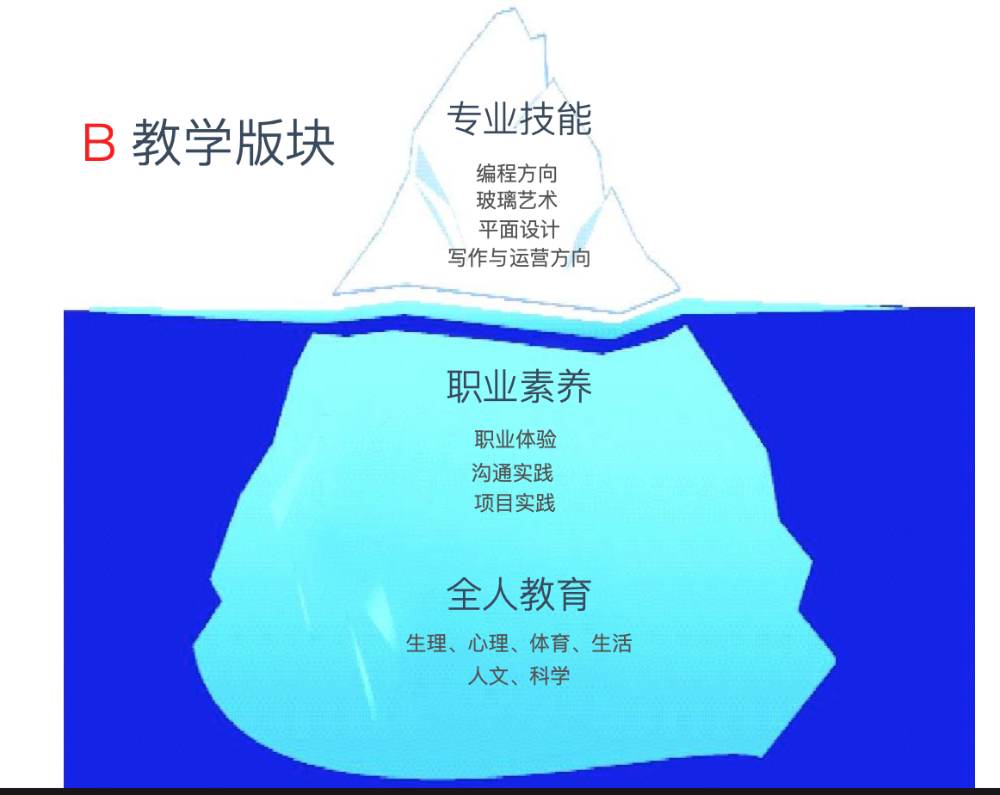]]

---
# 三个阶段

- 2018，素质教育
- 2019，职业教育
- 2020，素质 + 职业教育

---
# 三个阶段

- .red[2018，素质教育]
- 2019，职业教育
- 2020，素质 + 职业教育

---

# 2018 年，素质教育

- 2018 秋季学期

- 前半学期
- Python 编程
  - 绘画，潜艇游戏
  - 乐高EV3机器人

---
# 课本

.center[.width-60[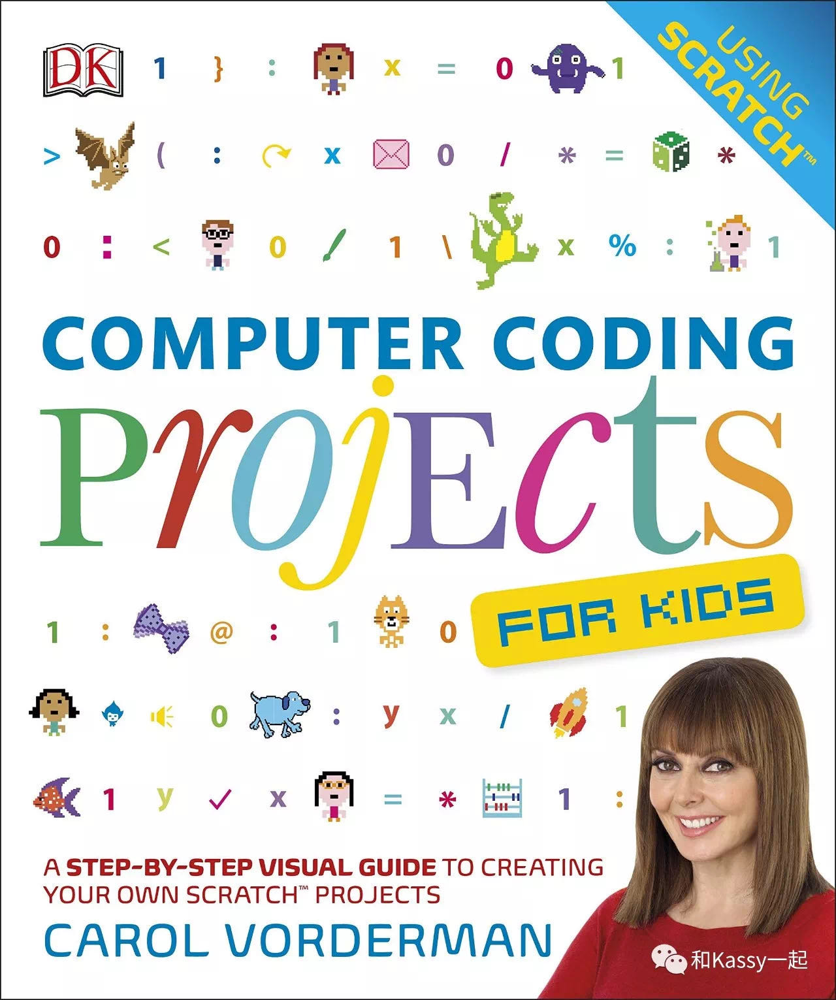]]

???

挑战

- 在自由和管理之间，如何平衡
  - 孩子的自我管理能力
- 在资源和目标之间，如何现实
  - 编程需要大量的学习和练习
  - 教师支持不够（时间资源，人）
  - 学生的学习时间资源
  - 编程在整个学堂培养体系中的定位

---
# 发现

- Python 语言编程作为一个比较高端的技术形式，和学生逻辑、数学、英语和物理基础的张力
  - 绘五角星、随机数、潜艇和机器人运动，涉及到几何、速度、面积、移动等数学和物理概念
- 毕业紧迫性和培养速度（学习规律）的张力
  - 编程需要大量的学习和练习
  - 教师支持不够（时间，人力）
- 不同年龄、知识基础、学业水平的同学在同一套课程进度安排下的张力
  - 初中 + 高中

???

- 职业向往和当前学业水平的张力

---
# 学到的东西

- 学习内容要与学生“寻找一条出路”的意识相吻合
  - 就是要”有用“，”能找到工作“
  - 18岁的孩子，会问：做这个潜艇小游戏，有什么用？
- 要现实
  - 1-3年，以现在的基础，能培养出一个合格的 Python 数据工程师吗？
- 个性化教学
  - 课程材料要匹配学生目前的水平，特别是数学和英语水平

???
# 要进行学生管理

- 志愿者一周一下午时间，完全不够
- 志愿者不在了，作业完成不理想
- 考试完全不 Care

# 当时的情况

- 因为是兴趣课，这种张力还不突出

---
# 改变

- 调整内容
  - Web 开发：Java + HTML/CSS/JS
- 寻找自动化的练习系统
  - 代替教师，及时给出反馈
- 寻找课程管理系统
  - 跟踪学生状态，降低教师课程管理工作量

---
# 2018 年秋季后半学期

- Khan 教学系统
  - Web 导学和练习系统
  - 课程管理系统
- 评价
  - 艺璇：可汗太好了
  - 欧阳：推荐给弟弟的小学老师。老师反馈：这个太好了
  - 财新主编王烁：女儿刷可汗
  - 李永乐：做中国的khan

---
# Khan 练习系统

- 王艺璇作品

.center[.width-110[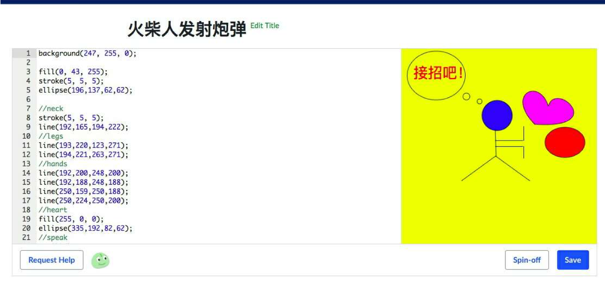]]

---
# Khan 学生学习时间分析

.center[.width-110[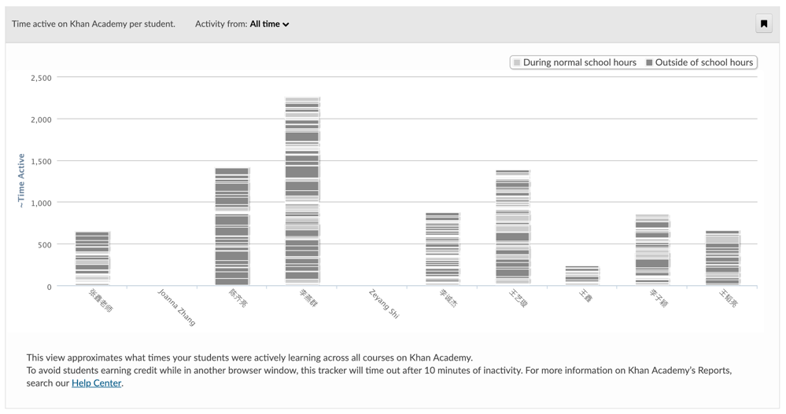]]

???
# Khan材料的学生讨论

.center[.width-80[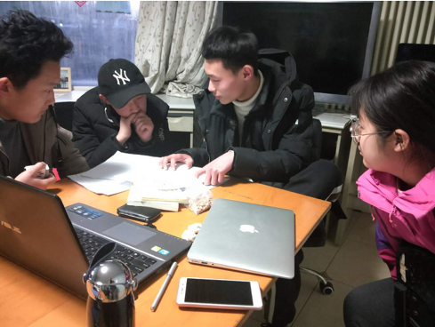]]

---
# Khan 学生讨论

.center[.width-90[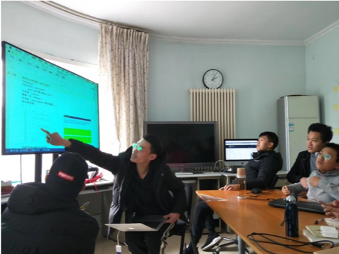]]

---
# 期末网站设计

.center[.width-110[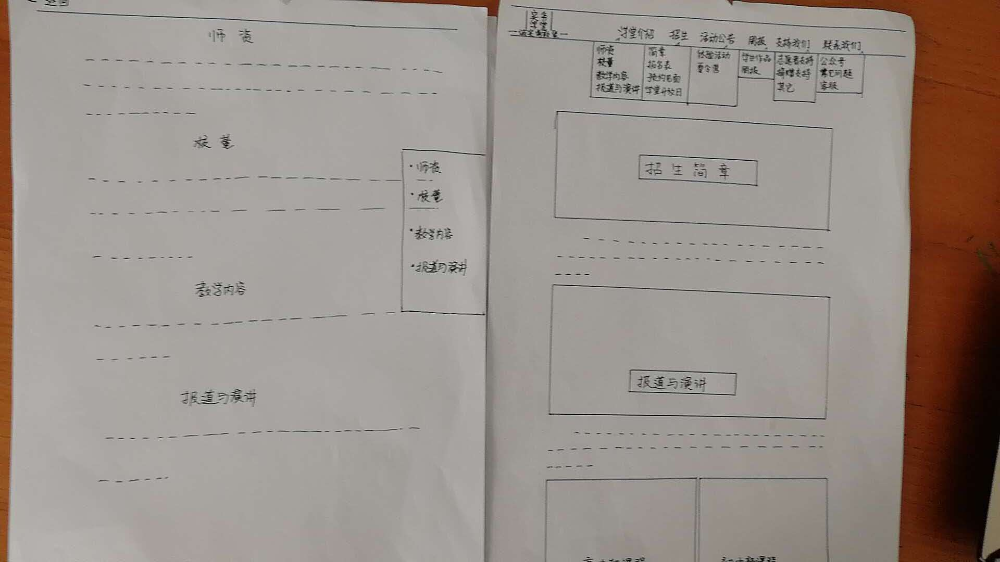]]

---
# Khan 的不足

- 针对中学生的兴趣教育（AP）
  - 陈齐亮特别喜欢
- 能找到工作吗？
  - 好像不能
- 向职业走一点点
  - 寒假作业：W3school 的 HTML、CSS、JS 练习系统

---
# 三个阶段

- 2018，素质教育
- .red[2019，职业教育]
- 2020，素质 + 职业教育

---
# 2019年春季学期

- Java
  - 自编课程 + Vijios 练习系统
- 中国大学慕课网
  - 南大《程序猿与攻城狮》软件工程慕课
  - 林大、清华、西交
- 职业培训机构课程
  - 尚硅谷、黑马程序员、传智
- 但没有一个好的.red[练习系统]和.red[课程管理系统]

???

# 开学时做了两个课程的计划

- 计算机科学入门
  - 洋葱数学
  - 专业英语（Khan）
- Web
  - 林业大学《Web前端开发》慕课
  - 传智：张鑫老师上个月来电，上市了，50亿人民币

???
# 罗明杨的出现

- 2019-03-02 19:38:20	罗明扬

- 主要是在看那个南京大学的视频，做了一些笔记，看视频认识了编程大概是什么，认识编程，还有编程项目的组成部分，三架马车，还有互联网的应用和未来的万物互联。其他老师小熊老师让我们注册了自己的中国大学mooc的账号，然后魏林老师让我们注册的学习编程的那个网站的账号，最后一节好像是郭洪超老师的，讲了一些关于编程的一些学习方向pystom？，，c语言，还有java能做什么，和自己选择的方向，第一种是自然语言（应该是比其他两个简单用于开发一些游戏什么的，）然后是java是一些比较基础的语言吧。不过比较慢。
- 学会了写日记和记笔记（之前都没有做过这两件事），写日记可以记录我每天的发生的一些事情，记笔记在我忘记的时候可以看一下，这两个习惯都挺好的，养成一个习惯需要三个星期的时间，希望我能坚持下去，以后这两个习惯一定能帮到我的。
- 编程，这门课难度最大，其他的课程多少接触过，基础还不错，可编程完全没接触过。
- 比起原来压榨式教学已经很好了，认识很多朋友也挺开心的。

# 罗明杨

2019-03-09 23:22:17

- 视频主要看了前端工程师的发展问题，然后就是实际写的，学会了system.out print(打印语句)还有scanner     计算，int和double赋值       还有if和else语句。然后自己能做出来几个简单的程序了，有售票机程序，收银台程序等。感觉写程序也挺开心的，跟打游戏差不多嘛，而且写完程序之后看着它能跑起来真的开心！	哈哈哈终于能自己写程序了，自己写的程序能跑起来贼开心哒！
- 对新朋友更加了解了，然后食堂终于不是清一色的米饭了(终于有馒头面条什么的啦！)，困惑就是晚上要收手机啊(其实都多大个人了差不多也能管住自己了)白天或者半夜起床没有手机的恐惧感.jpg
- 继续学编程吧，然后英语应该会变难一点，数学和物理的进程都不快。能把精力放在编程课上就行	编程课有点少，然后就是那个视频，整天看有点无聊了。
- 开心啊，一周眨眼就过去了，在原来的学校是度日如年诶。、-
- 发现编程跟玩游戏一样，看程序跑挺开心的。	失去了我的手机
- "编程还有跟同学们的相处。在学习java语言并运用起来的时候特别开心

---
class: middle, center

## 一个重要发现

# FCC

### FreeCodeCamp 前端练习系统

---
# FCC 前端练习系统

- 内容.red[专业]
- 面向想走上前端开发.red[职业]道路的人
  - 国内外很多人已通过做 FCC 走上了前端开发职业道路
- 如获至宝

---
# 学术界对FCC的评价

- CMU人工智能导学系统教授
  - .red[测试]驱动的学习
  - 你知道呆会有一个测试，就会特别认真学习
- 那时候，测，还是不测，是一个问题
  - 我们的学生对测试有恐惧
- 但他们不怕FCC的这种测试
  - 每个人都做FCC，乐在其中

---
# 罗明杨的出现

- 2019年3月入学
  - ”写完程序之后看着它能跑起来真的开心！	哈哈哈终于能自己写程序了！”
- 魏林老师 Java + 南大 + 林大慕课
- 学完 FCC，自己就上路了
  - 接着刷职业培训视频、LeetCode
- .red[“FCC特别重要”]
<!-- - 坚定了我们做职业教育的信心 -->

???
# FCC

- 2019年7月
- 和FCC中国的Miya联系上了

.center[.width-110[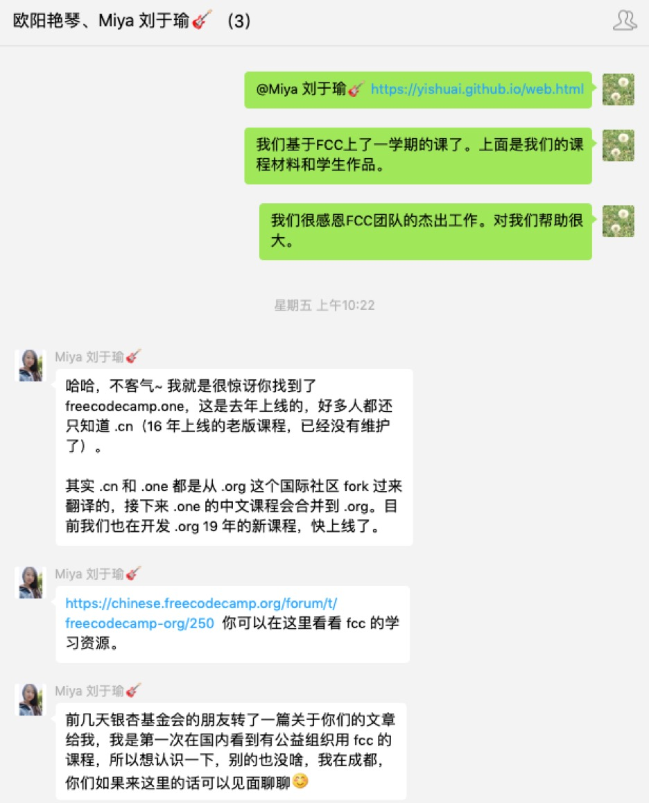]]

---
# 小插曲

- 2019年秋季入学新生的引导
  - 新生情况复杂
  - 发现了谷歌的 Blockly 编程兴趣入门
  - 练习程序员的思维逻辑
- 一个月的工作坊
  - 课程材料：https://yishuai.github.io/blockly/index.html
---

# 谷歌 Blockly

- 老少皆宜

.center[.width-90[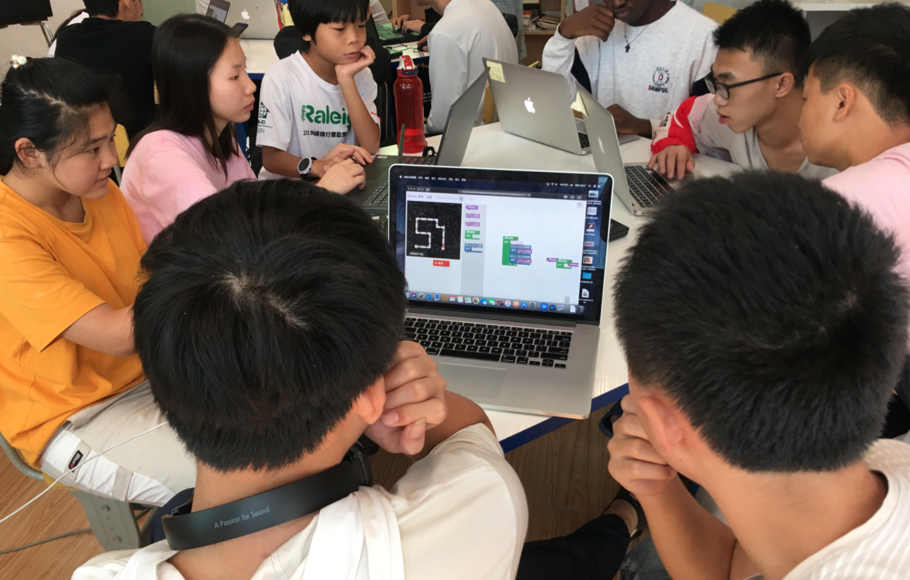]]

---
# 谷歌 Blockly

- 张鑫老师也很投入

.center[.width-90[]]

---
# 谷歌 Blockly

- 欧阳老师做出来时的惊喜

.center[.width-80[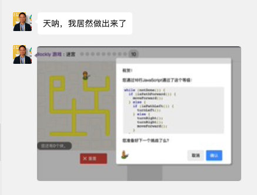]]

---
# 罗明杨的成功给我们一种错觉

- .red[“前端不用教”]
- 关键是
  - 提升学生自学能力
  - 找到最好的学习材料
  - 跟随经典的学习路径
- 学生们就会往前奔

???
class: middle, center

# 2019年9月

## 回龙观咖啡馆
# OKR！
## Objectives and Key Results

目标与关键成果法

明确和跟踪目标及其完成情况的管理工具和方法

英特尔公司创始人安迪·葛洛夫（AndyGrove）发明

---
# 实际上

- 大家没有跟上
  - 大学慕课视频都在看、作业也在做、FCC都刷了
- 但试着刷职业学院视频、做他们的练习时，就跟不上
  - 不知道他在讲什么
  - 有的同学怀疑自己：“罗明杨才行，我可能不适合”

---
class: middle, center

# 问题

为什么明扬能够跨越，其它同学不能跨越？

.red[现在的课程材料中间一定缺东西]

## 什么东西？

???

- 新的张力
  - 明扬型学生和其它同学需求的张力

- 问题
  - 明扬是Ok了，其它同学怎么办？
  - 女生怎么办？
  - 混到一个班，其实会影响慢的同学的学习积极性。他会怀疑自己
- 这种张力直到今年12月才部分解决
  - 办法：分班
  - 挑战：教师资源短缺

---
# 当时的处理办法

- 推动每个学生变得像明扬那样
- 时间管理、目标管理
- 陪伴
  - 田发伟老师：守着家祥，制定详细计划，每日打卡
  - 一个个同学过：每人20分钟

???

问题

- 怎么让其它同学达到明扬的水平？

2019年7月

- 志愿者大会
- 极客学院李桐老师，资助课程视频
  - 明扬学习了
  - 特别感谢！
- 郭超洪老师
- 田发伟老师

2019年秋季学期

- 魏林老师
  - 斯坦福 Java 课材料
  - 志愿者中文翻译
  - CMU AutoLab
  - B 站视频
  - 明扬助教
  - 田发伟老师助教

线下和线上的张力

- 魏林老师转为线上

# 同时寻找学习材料

- 国内的材料似乎还是有欠缺，国外找
- 课程
  - 宾夕法尼亚大学 eDX 课程
  - 哈佛CS50的 Web 部分
  - 斯坦福

---
# 教学方式

- 把职业学校课程、国外大学课程翻译为中文，给学生们讲
- 最可怕的一次是我把哈佛 CS50 2小时 Web 课，给他们也两小时讲完了
  - 因为觉得: .red[等不起学一个月]
  - 结果：全懵
- 现实
  - 上个月，经过又一年的学习后，我给其中四位学习进度较快的同学又讲了一次，这次听懂了
- 可见去年教学方法的问题

???

Confluence

- 田老师
- 钉钉

# 机缘

- 7月，欧阳老师同学，王欢老师，有幸在蒙特利尔见到了
  - CS50 就是她推荐的
  - 她说哈佛有一层楼的人，就做这一个课程
  - 就去看 CS50，体会他的教学方法，只是觉得新颖
- 王老师说这些年来，关于教学方法的讲座没少听
  - 我就找她要材料

---
# 转机 1


- 12月，欧阳老师同学，王欢老师发来 哈佛 Derek Bok 教学研究中心的网址
  - 《如何设计一门课程》
  - 《如何上课》
  - 《人类学习的一般规律》
- .red[《以终为始：从期末大作业出发的课程设计》]

---

# 转机 2

- 张鑫老师
  - 《青少年心理学》
  - 青少年大脑发育（特别是理性思维能力、自控能力）是有一个过程的
- .red["你要等"]

---
# 转机 3

- 发现 Code Nation https://codenation.org/

.center[.width-80[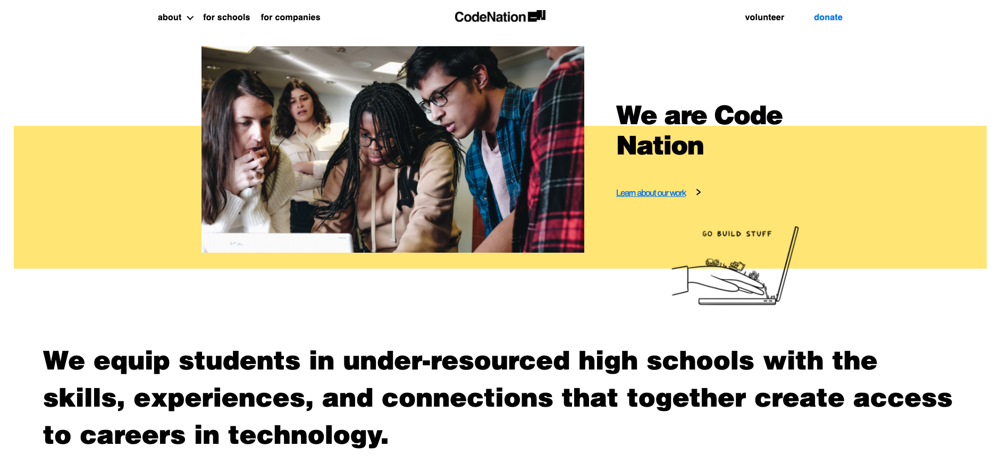]]

- “为资源受限的高中学生提供技能，经验和联系，使他们能够共同进入技术职业”
  - 特别适合我们

---
# 培养方案给我们的启发

- 接触（Exposure）
  - 课后班（初阶）
  - HTML，CSS 和 JavaScript，JQuery 简单网页
- 体验（Experience）
  - 暑假集训（小学期）
  - JavaScript（API）、项目、专业素养（白板编程，电邮）
- 职业（ Agency ）
  - 更高级API，Firebase，前端框架（ReactJS），职业（简历，作品集）
  - 实习

???

(https://github.com/itscodenation/curriculum19-20)
---
# 课程材料给我们的启发
- 每次课就一个小知识点
  - 讲解、示范、课后测验（Exit）
- 练习
  - 动画、漫威、篮球、小游戏
  - 特别小的项目，很有趣
  - 稍微认真一点，一定能做出来
  - 也不会说没劲，不愿意做

---
# 自动化练习系统给我们的启发

- Popcode 前端练习系统
- 能够给出人性化的错误提示

---
# 转机 4：Canvas

- 基于云的免费课程管理系统
  - 跟踪学生状态
  - 斯坦福、MIT都用

???

- 欧阳老师：一切
- 陈怡老师：英语
- 李志老师：数学、C语言、算法
- 徐天晟老师：Linux、数据库
- 熊治杰老师：Web、Javascript

---
# 重构

- 以练习为中心
  - CodeNation 练习翻译，入库
- 讲课视频随讲随整理入库
  - 慢一点的同学就慢一点，东西都在，慢慢学
- Canvas学生作业状态追踪
  - 一目了然

---
# 上帝的恩赐

- 去了广州
- 舒欣老师加入
  - 有 .red[实际Web前端开发经验]
  - 有分享精神、教育理念
  - 能够 .red[线下教学]
- 中国这么大，我们现在真的只找到了这一位
  - .red[请联系我们!]

---
# 三个阶段

- 2018，素质教育
- 2019，职业教育
- .red[2020，素质 + 职业教育]

---
class: middle, center
# 2020: 素质 + 职业教育

## 我们重新再来

---
# 这一年

- 2-6月：春季学期
  - Code Nation（远程教学）
- 7-8月：小学期
  - 广州开学（伯克利大学网站设计和实现 + 舒欣老师前端实战 + 英语）
- 9-1月：秋季学期
  - 广州新教室 （纽约大学Web绘画 + 舒欣老师前端实战 + 李志老师NOIP信息学奥赛+ 徐天晟老师 Linux数据库 + 熊治杰老师 JS + 欧阳老师 前端）

---
# 春季学期

- CodeNation 小项目
- 特别开心
- 同学的话
  - “好期待做作业啊”
  - “老师今天只有一个作业么？”
- 听到这些话，第一反应就是：成了

---
# 同学作品：三月

- 艾克

<video width="560" height="420" controls>
    <source src="./figures/2020/3-6-cn/3.mp4" type="video/mp4">
</video>
---

# 同学作品：四月

- 罗家祥同学

.center[.width-50[]]
.center[[点击体验](https://mcqueen5258.github.io/whackLuo/)]

---
# 同学作品：四月

- 崔永祥同学

.center[.width-30[]]

.center[[点击体验](https://hcnjyfv.github.io/ex24/)]

---
# 同学作品：四月

- 葛雨城同学

.center[.width-90[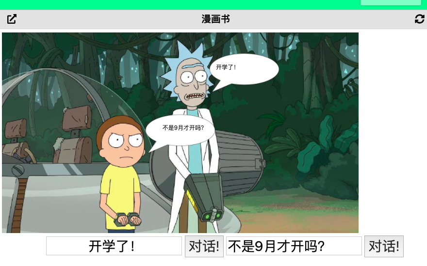]]
.center[[点击体验（Popcode）](https://popcode.org/?snapshot=b7d3f215-19fc-4130-af7f-d3f0b6c08dad)]

---
# 同学作品：五月

- 王台归同学

.center[.width-60[]]
<!-- .center[[点击体验](https://wtg378900.github.io/-4/)] -->

---
# 同学作品：雷涵

.center[.width-90[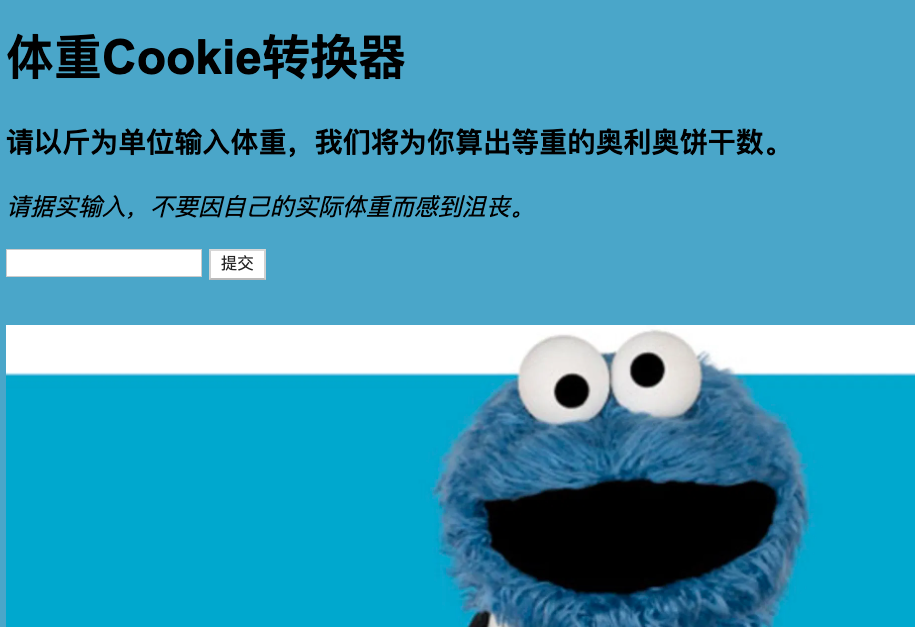]]
.center[[点击体验](https://leizhonghan.github.io/operation/)]

???
# 英语

- [Quizlet](https://quizlet.com/class/13272136/) 谷歌“单词卡”工具
  - 哈佛推荐
- 游戏式学习，对战，帮助记忆、复习
  - 罗明杨同学曾表示强烈推荐

.center[.width-60[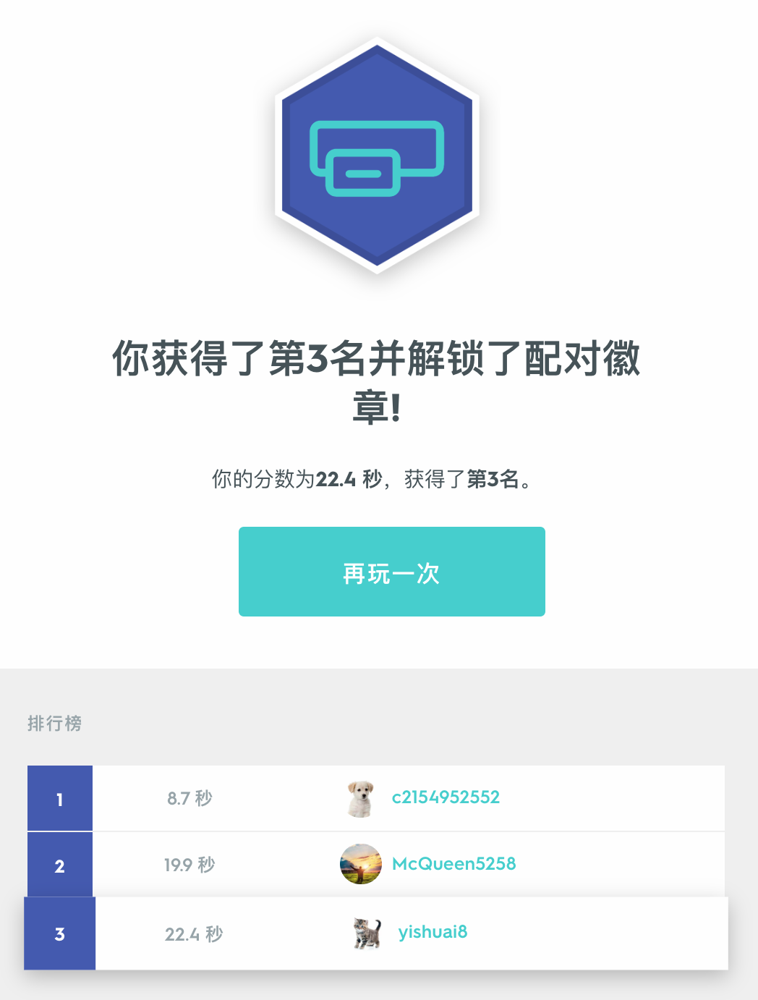]]

---
# 英语

- 陈怡老师
  - 程序员英语对话

.center[.width-90[]]

???
# 四月：阿里云大学

- 资助Web前端工程师认证
- 感谢！

.center[.width-40[]]

---
# 期末大作业 （六月）

- 艾克小组作品：科蚪电影节购票网站

.center[.width-60[]]
.center[[点击体验](https://mcqueen5258.github.io/2020works/cinemaTicket/)]

---
# Canvas 练习结果

- 28个练习
- 得分不均匀：25-335
  - 慢一点的同学就慢一点。欧阳老师现在带大家在往前走

.center[.width-110[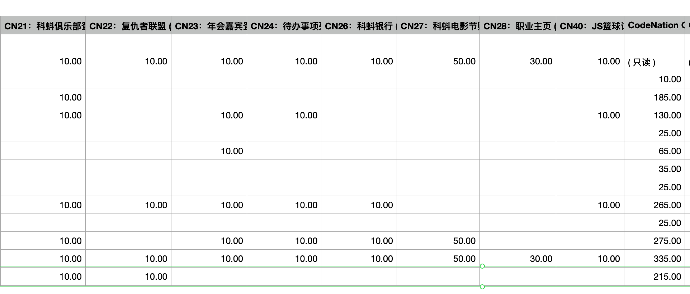]]

???
# 六月：证书

- 可汗的证书

.center[.width-80[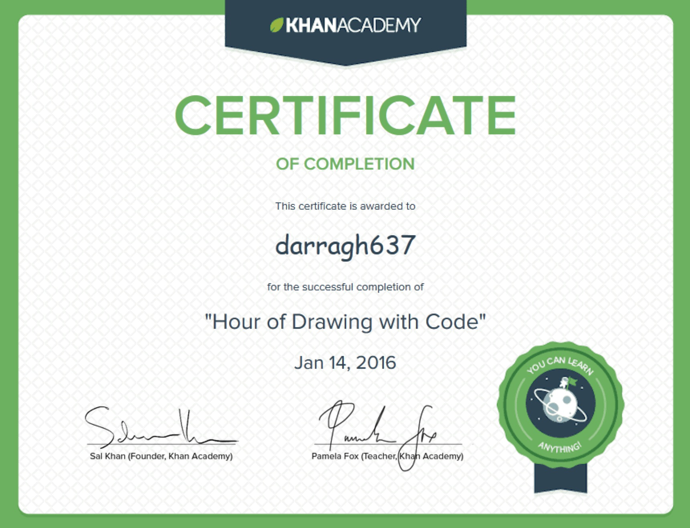]]

---
# 证书

.center[.width-100[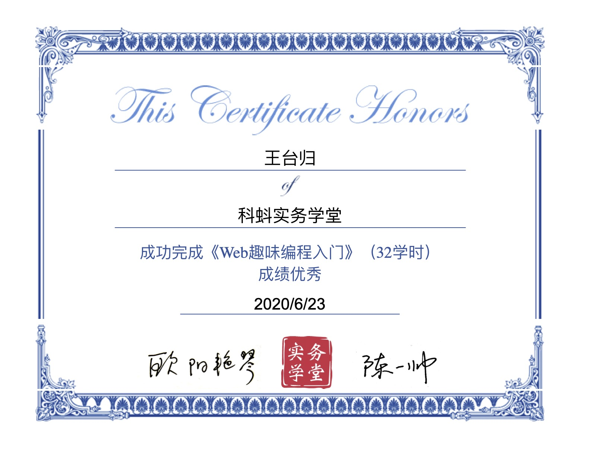]]

---

# 我们的 CodeNation 材料

- https://yishuai.github.io/js/index.html
- 校外同学留言：期末就靠它了
  - 所以可能有一定的推广价值
  - 挺高兴的

---
# 五月新进展：第一位实习的同学

- 罗明扬同学，2019年3月入学
- 青岛海尔，Misshop 管理软件快速开发平台

<!-- .center[.width-40[]] -->

- 特别感谢潘迪老师！
- 用人单位反馈特别好
  - “还有没有这样的？”

???
http://www.misshop.com.cn/

class: middle, center

## 在海淀区人大路口，我就问欧阳老师：
# OKR完成？

---
# 7-8月：小学期

- 广州开学
- 舒欣老师前端实战
- 伯克利大学网站设计和实现（WDD）
- 英语

---
# 舒欣老师前端实战

- 切苹果网站
  - 做出来了，学生们很开心：.red[学了这么久，原来学的这么有用！]

.center[.width-100[]]

---
# 舒欣老师前端实战

.center[.width-90[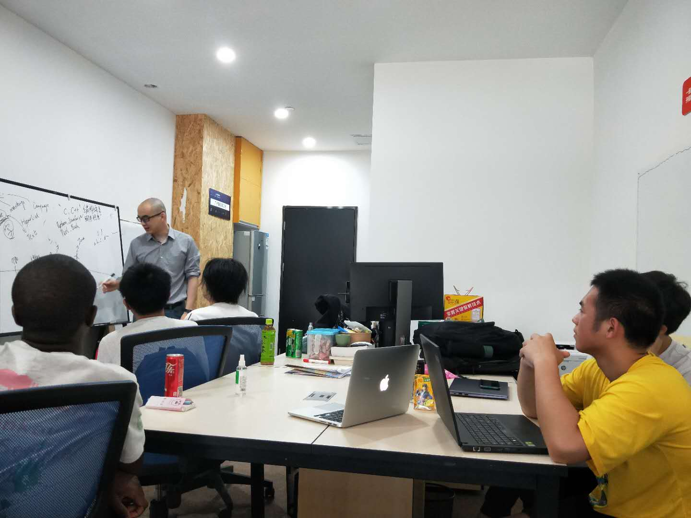]]
---
# 舒欣老师前端实战

.center[.width-90[]]
---
# 舒欣老师前端实战

.center[.width-90[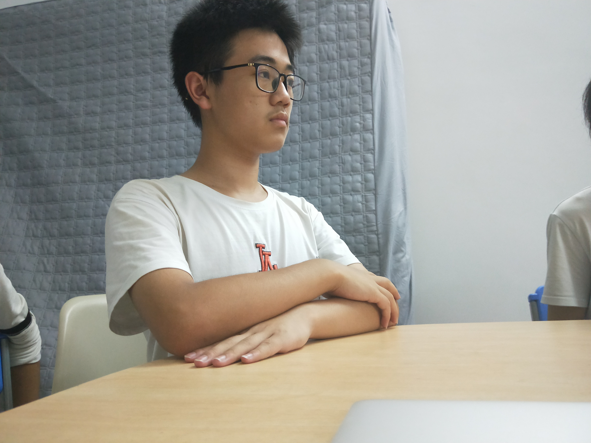]]
---
# 伯克利大学网站设计和实现

- 配合舒欣老师
  - 每周两次课。他做到哪，我就讲到哪

<!-- .center[.width-100[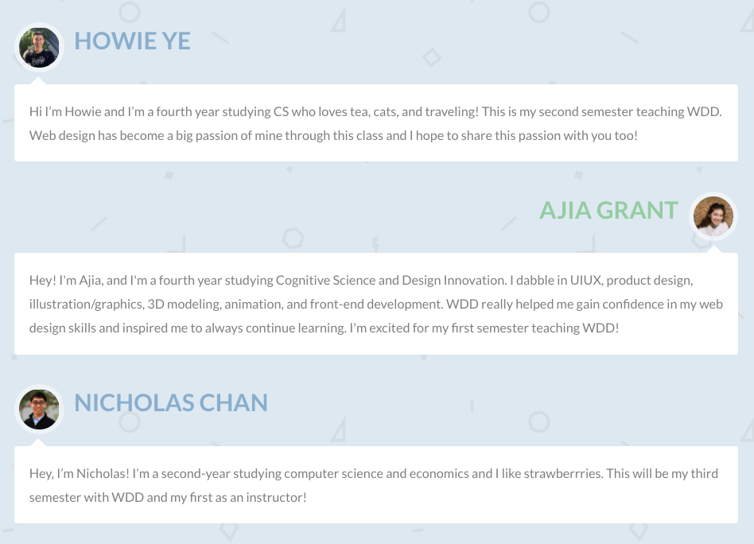]] -->

<!-- - 体会设计之美 -->

.center[.width-100[]]

---
# 伯克利大学网站设计和实现

- 伯克利学生开发、算学分
- 内容极专业，项目极有趣
- 欧阳
  - “昨天带我的朋友玩 flexboxfroggy，这个过程特别好玩，因为她完全没有学过 flexbox，跟着介绍玩，玩了8关，还想玩，我要做作业了，就制止了”

???

# 同学作品：葛雨城

<video width="660" height="520" controls>
    <source src="./figures/2020/8-wdd/雨城.mp4" type="video/mp4">
</video>

---
# 同学作品：周光明

- 租车网站

.center[.width-100[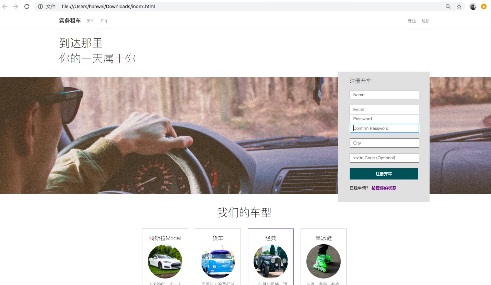]]

---
# 同学作品：艾克

<video width="660" height="520" controls>
    <source src="./figures/2020/8-wdd/艾克.mp4" type="video/mp4">
</video>

---
# 同学作品：雷涵

<video width="660" height="520" controls>
    <source src="./figures/2020/8-wdd/雷涵.mp4" type="video/mp4">
</video>


---
# 陈怡老师：编程英语

- 每天从大海边上录一段英语单词发过来
- 特别感谢！

.center[.width-110[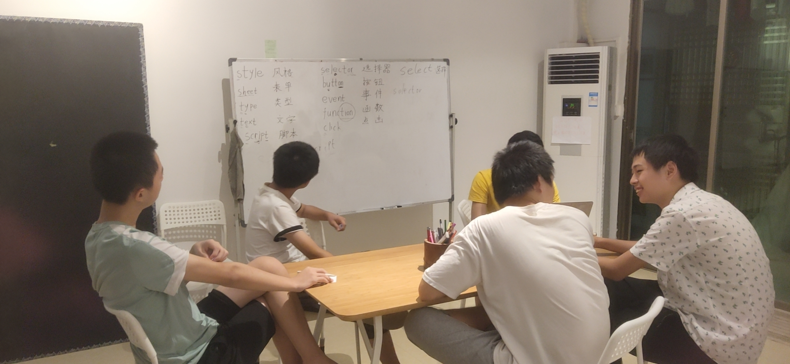]]

---
class: middle, center

## 小学期结课

### 同学反馈

# “一个月学到的比一学期还多”

我们的WDD材料：https://yishuai.github.io/wdd/index.html

---
# 9月：另两位同学企业见习

- 艾克，台归
- 北京润乾
- 谢谢潘迪老师！
- 同学反馈
  - 知道什么是“工作”了
  - .red[“现在最想做的就是学习！”]
- 前几天开放日同学分享
  - “这一年印象最深的是什么？”
  - “见习”

---
# 9月 秋季学期

- 广州新教室
- 纽约大学 Web 绘画
- 舒欣老师前端实战
- 李志老师 NOIP 信息学奥赛
- 徐天晟老师 Linux + 数据库
- 熊治杰老师 Javascript 算法
- 欧阳老师 Web前端开发

---
# 9月 新教室

.center[.width-100[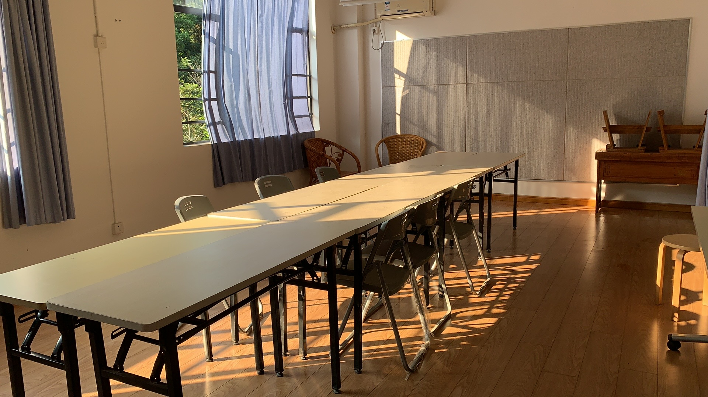]]

.center[特别感谢基地！]
---
.center[.width-60[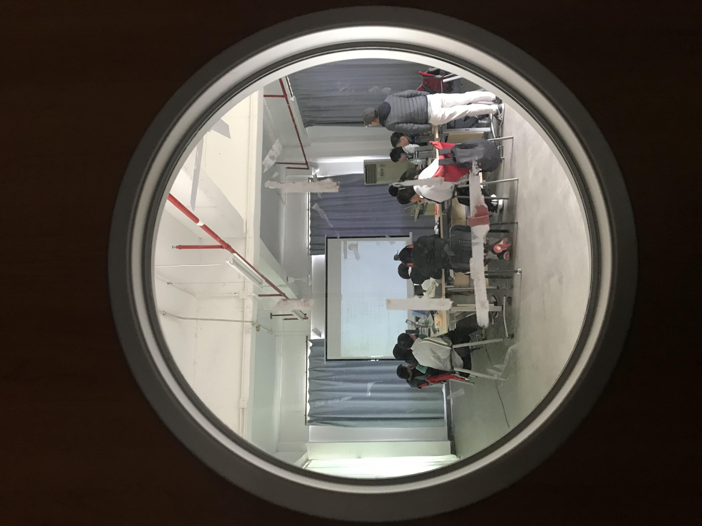]]

---
# 同学状态

.center[.width-100[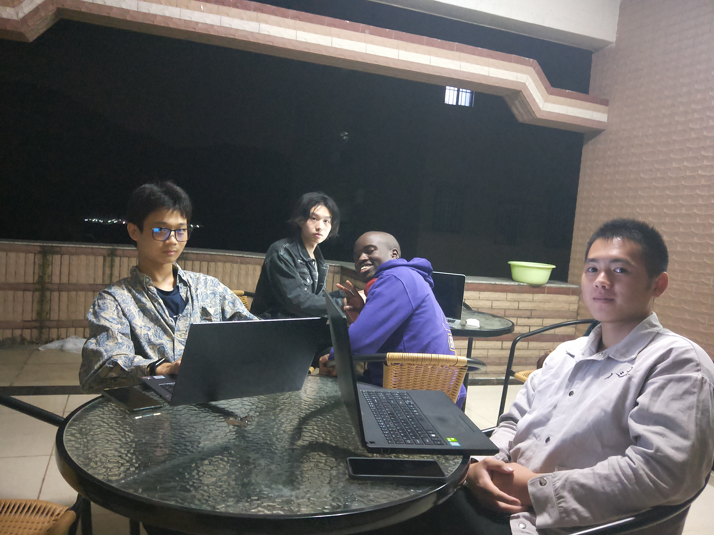]]

???
# 同学们状态也有分化

- 几位同学 100% 完成了课程
- 其余同学情况复杂
  - 有没参加小学期的
  - 有完成50%的
  - 有完成10%的（如上表）
- 慢的同学逐渐产生自我怀疑

# 等了一会

- 自主学习计划
- 导师制
  - 周六上午挨个打电话，说清楚了
  - 找50%的练习
  - 计划

---
# 金玉老师：如何做计划

.center[.width-110[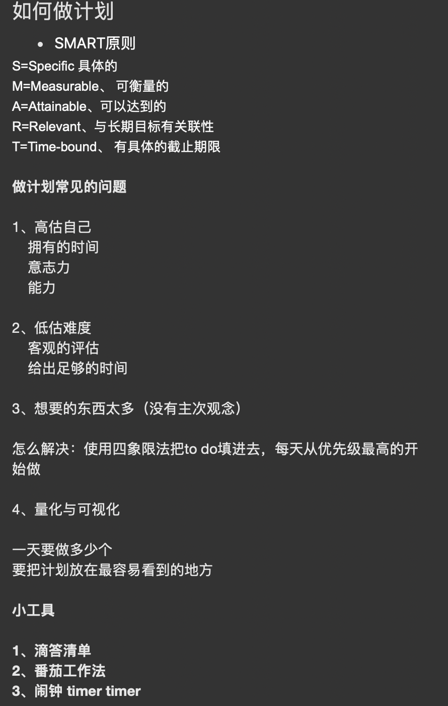]]

???
# 自主学习计划的问题

- 自主学习的孤独感
- 有的学生就自己搞自己的了
- 有的学生喜欢合作
- 我们是要培养合作能力的

# 另一种张力

- 作为一个志愿者老师的问题
  - 每周一次课
  - 钉钉、微信沟通
  - 不够
  - 一堂课，2个小时，每个同学过一遍，每人10分钟不到。互相之间的讨论很少
  - 学生们可能也觉得浪费时间

# 什么是自主学习？

- 不是一个人在学习，是一群情况相同的人在合作学习
- 慢的同学，等是解决不了问题的
  - 应该是：重修

---
# 分班

- 不同年龄、知识基础、学业水平的同学在同一套课程进度安排下的张力
  - 分班
- 没有老师怎么办？
  - 欧阳上
  - 我凌晨劝：学校事情已经够多了，算了
  - 她回：.red[“对我来说，内心的声音是，我希望支持到老师和学生。”]

---
# 欧阳老师9月作品

- CodeNation

.center[.width-60[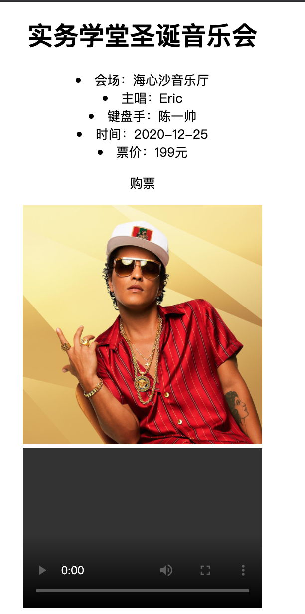]]

---
# 11月计划

.center[.width-120[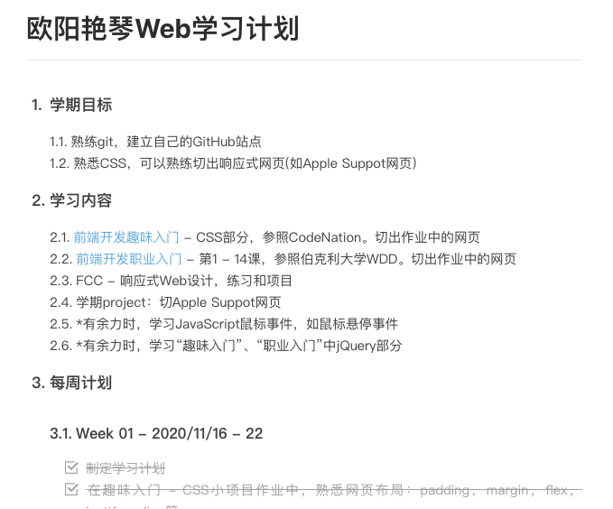]]

https://shimo.im/docs/ycdgGjwvtGgYVxdw/

---
# 12月课上分享

.center[.width-80[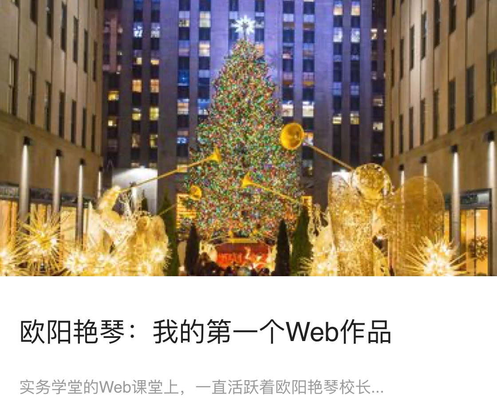]]

https://www.bilibili.com/video/BV1X5411V7vK/

---
# 1月工作台展示

.center[.width-100[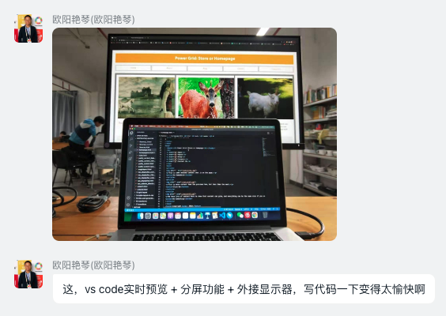]]

---
# 纽约大学 Web 绘画

- Joshua Clayton：https://www.joshuaclayton.net/about/
- 我们的材料：https://yishuai.github.io/draw/

.center[.width-60[]]

???
# 哈佛大学 CS50 Web课

- 发现 DOM 还是似懂非懂的
- 哈佛 CS50 Web 2小时课程
  - 主要是DOM
  - 学了四次课（8小时）
- 终于都听懂了

---
# 艺文作品

- SVG 动画

.center[.width-40[]]

.center[[点击体验](https://cyw20031123.github.io/qiMoKaoShi/cn8/Happy%20New%20Year.html)]

.center[.smallest[(打开网站后，请点击“新春快乐”文字体验动画效果)]]

---
# 艺文作品

<!-- - 新年红包 -->

.center[.width-30[]]

.center[[.smallest[点击体验]](https://cyw20031123.github.io/qiMoKaoShi/cn10/Red%20envelope.html)]

.center[.smallest[(打开网站后，按提示点击互动)]]


???
# 艾克作品

- 互动莲花
  - 请把鼠标移到莲花上
  - 请用鼠标点击莲花

https://mcqueen5258.github.io/examination/Lotus/

---
# 12月新的职业机会

- 广州艾利丹尼森
- 邀请访问、测试
  - .red[感谢！]
- Javascript 算法
  - 还没来得及教

---
# 想起当年参观完谷歌

.center[.width-60[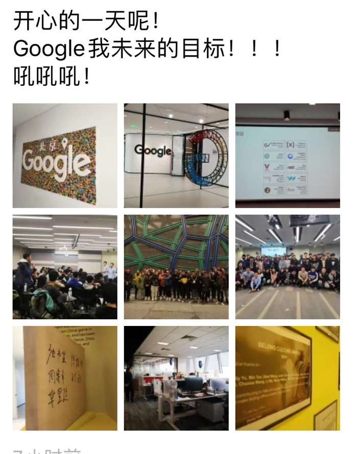]]

---
# 张鑫老师

- 问了，只考算法

.center[.width-110[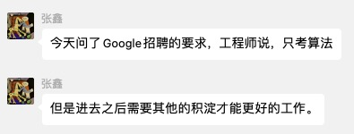]]

---
# 李志老师算法课

.center[.width-100[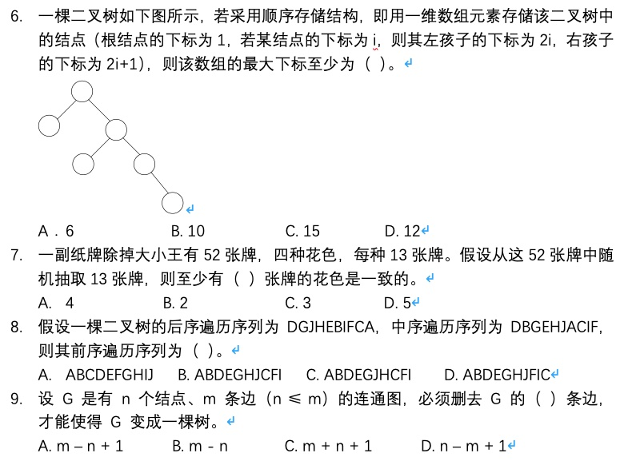]]

---
# 徐天晟老师计算机课

- Linux + 数据库

.center[.width-100[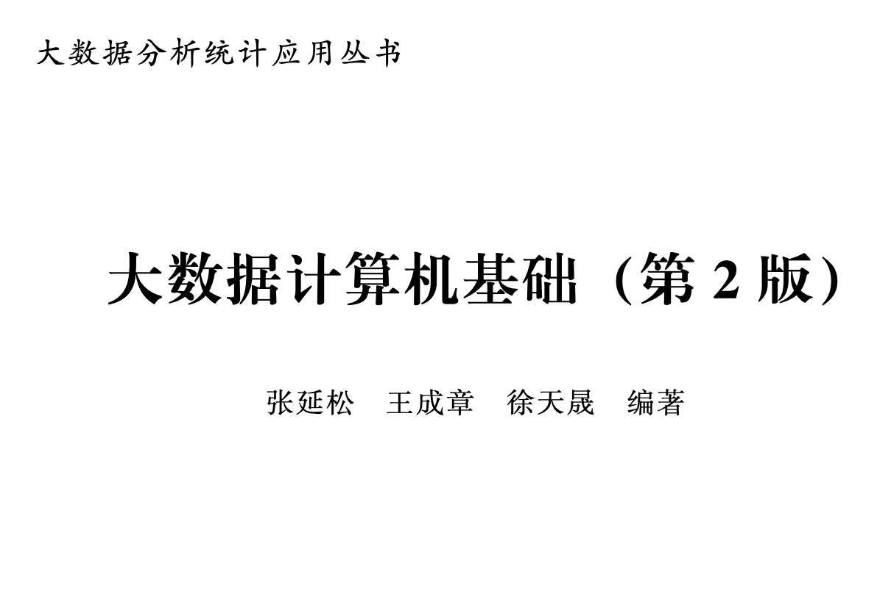]]

---
# 不幸的是

- Javascript 算法我至今还没教！
- 就有点着急

---
# 幸好有熊治杰老师

- FCC Javascript 算法

```js
/* 详解 arr.splice(start, deleteCount)
作用：删除数组里的元素，返回值为被删除的元素，返回值为数组类型
参数：start是开始删除的索引，deleteCount为要删除元素的个数
探索：试试使deleteCount为负数，或者让start+deleteCount超过数组长度
*/

// 思考：如何删除数组中指定位置元素？

// 问题描述：请删除数组arr中的索引为index的元素
var arr = [1, 2, 33, 44];
var index = 2;

// 代码请写在下面
```

---
# 明扬也回来了

- 他一直以来的梦想
  - 带同学们做项目
- 给同学们介绍自己目前的工作
  - 选修，周末带大家做项目
  - Vue前端框架
  - 数据库

---
# 分班教学的管理

- Canvas 教学系统
- 练习和上课时间表

.center[.width-80[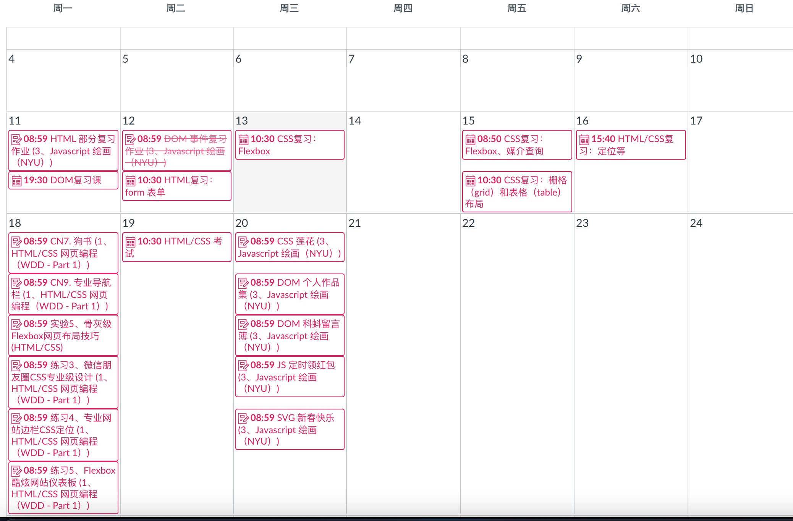]]

---
# 学生主页

- 学习任务一目了然

.center[.width-60[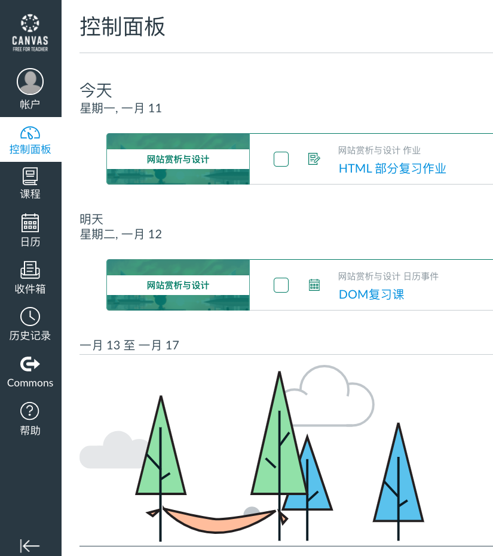]]

---
# 总结

- 基础
  - 计算机使用（Windows，Linux）
- 预科（接触）
  - Blockly 趣味编程 （可视化游戏界面）
- 入门（兴趣）
  - CodeNation：HTML/CSS/JS/React
- 职业
  - WDD，Draw，React，数据库，算法

???

12-plan.md

---
class: middle, center

.center[.width-110[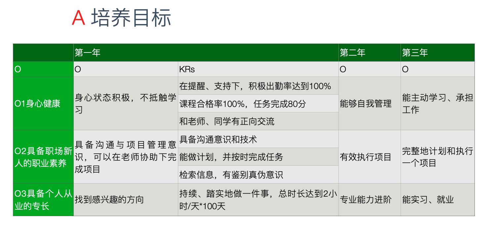]]

???
# 哈佛大学计算机科学学生手册

- 硬目标
  - 设计和编码正确的问题解决方案
  - 向社会外界解释系统设计方案的适用性
  - 听完一个 CS 讲座后，客观地分析和批判工作
- 软目标
  - 以口头和书面形式，清晰，有力地表达想法
  - 以合乎道德的原则，合作解决问题
  - 将自己的优势运用到实际中，解决社会不公、脆弱、和让人不舒服的地方
  - 在小组内高效，负责任和有效地工作

https://handbook.fas.harvard.edu/book/computer-science

# 我是谁

- 我其实也是一个小镇做题家
- 全县第1名，全省第85名
- 到了北京，第一年的功课就给了我一个下马威
  - 自主的学习方式完全跟不上
- 幸运的是交大试点班、硕士生导师、师兄师姐们
  - 真的是遇到好人了

# 工作后

- 到了朗讯，又完全跟不上
  - 智力没有问题
  - 但表达、组织、做事、做人的能力，完全没法比
  - 现在我知道这叫”全人教育“、”综合素质“
- 幸运的是朗讯
  - 比较人性化
  - 有一点科学家的范
  - 还是包容的

# 博士毕业留校任教

- 本来应该进入”青椒“序列，为了提职拼尽全力
  - 幸运的是去了纽约
- 在纽约发现完全跟不上
  - 原来人应该有所”热爱“

# 我

- 我就是内卷过来的小镇做题家
- 到了北京，第一年的功课就给了我一个下马威
  - 自主的学习方式完全跟不上
- 到了朗讯
  - 表达、组织、做事的能力，又完全跟不上
- 现在我知道这叫”全人教育“、”综合素质“

# 心愿

- 孩子们不要像我这样再来过
- 但事实是
  - 内卷，就是让孩子们像我这样，再来过
- 这就是我现在做的事情的意义

# 是什么支持了我

- ”今天晚餐，基金会有个项目总监，可能喝酒喝得也有点多，很动情，跑来跟我说：
  - 不要怀疑自己的价值，不要有压力，不要在意成功不成功，改变一百个孩子是成功，带出一个孩子也是成功。你们在做的事，是一件非常新的事，在全国，找不到十个人可以做。所以要坚信自己的价值。
- 和最近也比较焦急的一帅老师分享这席话。“
# 汇报

- 把在这个过程中学到的用到大学课堂上
- 大学生也很 Surprise
  - ”老师真的很感激您，我觉得您可能是我大学里第一位让我真正觉得大学有意义的老师。有很多认真负责的老手，他们教会我吃什么，怎么吃，告诉我吃很多难以下咽的东西能对我好，但我觉得您是一位让我知道我吃东西是 .red[为了什么]的人，真的很感激您！“
- 他也应该感谢实务学堂

???

  - ”谢谢老师这个学期的教诲！不仅仅是在通原这门课，更主要的是在这门课上我学到了一种enjoy的态度以及老师对我不断的鼓励！在大学里面遇到像您这样的老师真的是我的幸运！发自内心的喜欢！预祝老师新年快乐给您拜个早年！“
  - ”考试结束了，本年的课程我说实话，我感觉真的很紧，课上也有的时候会听不懂，课下了做题其实也感觉经常卡壳，好在遇到了老师你，我说句实在话，您是我在大学遇到最有意思也是最负责任的老师，真的不是为了吹您，我们宿舍都这么想，在期末那种环境下，只有您会真正的为我们考虑来担心我们的心态，真的很感谢您。“

---
# 科研

- 2019年，蒙特利尔，教育数据挖掘国际会议，见到了王欢老师，还有很多教育领域的研究者
- 项目
  - Web前端学习智能练习系统
  - 基于脚手架会话代理的智能在线导学系统
  - Python智能错误分析和反馈系统
  - 基于知识的数学练习信息抽取与图谱构建
  - 基于人工智能的学习材料聚类和推荐系统
  - 面向目标的智能课程发现和推荐系统

???

# 科研

- 人工智能造福社会
  - 基于人工智能的中文攻击性语言识别系统
  - 基于人工智能的中文自媒体欺骗性说服技巧识别系统
- 网络
  - 基于容器技术的网络路由实验平台
  - 基于eBPF的可编程网络路由协议实验平台研究
  - 基于 Web 的远程通信和协同创作平台

---
# 感谢

- 魏林老师
- 田发伟老师
- 郭超洪老师
- 王欢老师
- 极客学院（李桐老师）
- 学堂在线
- 阿里云大学
- 捐助电脑和设备的好心人
- Miya（刘于瑜）

---
# 彩蛋

- 《太阳能坚持到什么时候》
  - 好友谈书、荐书播客：喜马拉雅，[微信公众号](https://mp.weixin.qq.com/s/HEpz-Y8mNxn9qXG67V8UHw)
  - ”谢谢一帅老师。人文教育需要从长计议，在青少年人们贫瘠的沙地缓缓滴水，栽种，细水长流。最近计划着先做个公众号并一个音频播客推荐青少年读的书。”

.center[.width-90[]]

???
# 其实很多时候学生也教我

- 俊燕作品

.center[.width-110[]]

---
class: middle, center

# 编程是我们与世界交流的一种方式

<br>

俊燕作品

https://chenjunyan1.github.io/Wonderland/Introduction/home.html

???
# 12月，艾克学堂开放日作品

.center[.width-110[]]

---
class: middle, center

# 编程是我们应对世界挑战的一种处理办法

<br>
## .red[Debug (错误调试)]

---
<!-- # Debug （调试错误）精神 -->
.center[.red[Debug]：接受错误、解决错误、从错误中学习]

.center[.width-100[]]

???

.center[.width-110[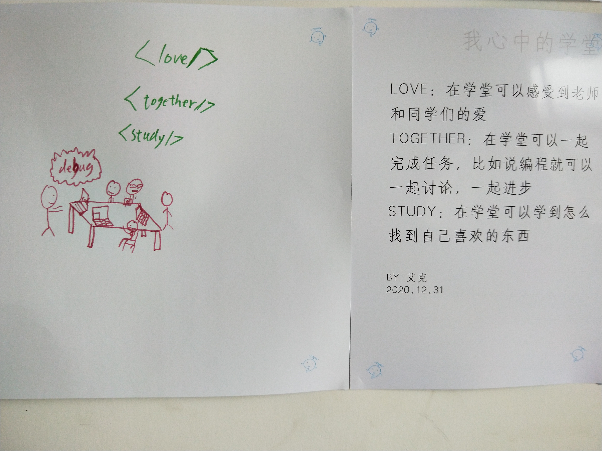]]

---
class: middle, center

# 编程让我们获得自由

???
# 教训

- 尊重教育规律

???

# 我们现在的状态

- 部分同学开始自主学习的探索
  - 导师：明扬
  - 带领四位同学；周末
  - 前端框架，数据库
- 这四位同学相当于明扬去年的状态
  - 经过1年的学习，在学习能力、知识积累、学习习惯上，也许具备自主学习的能力了
  - 也许会像明扬当年那样，学习了
  - 试试放手

# 我们现在的状态

- 慢一点，但愿意坚持的同学，继续完成CN和WDD
  - 导师：欧阳老师
  - 每周2次课
- 准确走前端职业道路的同学
  - 导师：Andy 舒欣老师
  - 一线开发经验 + 前端熟练练手
  - 两周一次课

???

我对编程专业的教学，思考还是不够的。当然我也愿意向您分享我的当下的想法哈。

第一，我觉得我们还是在慢慢瞄准一个我们学生可能胜任的职业方向，“程序员”其实很多元，还是有一些工作，兴许是适合我们的，我们的优势，可能可以落到务实、讲求实务。
第二，看到职业前景是重要的。比如去企业参访、测试、实习。综合项目，看上去是有挑战的，但是如果找到合适的方法，有好的支持，给学生会带来很大成就感，以及更好的目标感、整体感。但同时，还是需要反复练习。
第三，我们很难，又要给孩子爱，又要做职业训练，提要求。但是都得做。一帅老师太难得，又有爱，又专业，同学们真的很爱，很受益。
第四，团队要相互支持和信任。做一个专业，教一个专业技能，真的需要一个团队。
第五，还是核心要支持学生提高自学能力。

# 我们现在的状态

- 完成了CN和WDD、Draw的同学，下学期进入 JS高级，React
  - 治杰 + 我
- 算法
  - 李志老师
- Linux，数据库，数据科学
  - 张老师
- 新生，Blockly，JS 入门
  - 我 + 欧阳
  - 欢迎大家选课

# 构想

- 分析问题和解决问题的能力
- 学生们还是要写论文
  - 课程设计
  - 毕业论文

---
class: middle, center

# 欢迎大家的加入

.center[.width-50[]]

扫码访问幻灯片
