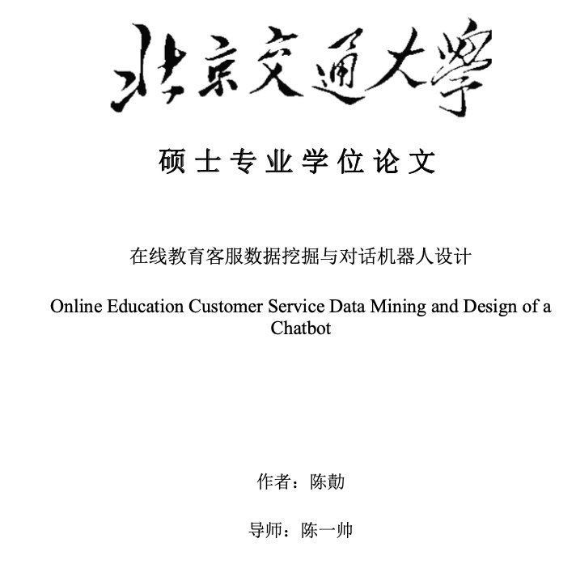

class: middle, center
# 一路走来
陈一帅
---
# 内容
- .red[自我介绍]
- 为什么要教编程
- 挑战
- 探索过程
- FCC
---
# 我
- 70后，湖南人
- 1994-2001，北京交通大学，通信工程专业，硕士
- 2001-2007，朗讯贝尔实验室，软件工程师
- 2007-2010，北京交通大学，通信工程专业，博士
- 2010-至今，北京交通大学，电信学院，副教授
- 2016-2017，纽约大学，访问学者
---
# 内容
- 自我介绍
- .red[为什么要教编程]
- 挑战
- 探索
- FCC
---
# [纽约历史协会](https://www.nyhistory.org/education/teen-programs/scholars-program) 编码实验室
- 面向女生
- 新冠病毒期间免费向全世界开放

.center[.width-80[]]
---
# 纽约编程活动
- 纽约教育局CS4All（[全套教案](cs4all.nyc/programs/courses/)）
- [Hackathon](https://hackny.org/hackathon/) （Spotify）
- NYU编程俱乐部

.center[.width-60[]]
---
# 教女儿编程
- Khan学院：算法入门（Javascript）
- 女儿笔记

.center[.width-40[] .width-40[]]
.center[微信公号]
---
# 教硕士生编程

.center[.width-70[]]
<!-- # 教家里的孩子们编程 -->
---
# 教实务学堂高中生编程
- 全人教育
  - ⽣理、⼼理、体育、生活 ⼈文、科学
- 职业素养
  - 职业体验、沟通实践、项⽬实践
- 专业技能
  - .red[编程]，玻璃艺术，平面设计，写作与运营
---
# 内容
- 自我介绍
- 为什么要教编程
- .red[挑战]
- 探索
- FCC
---
class: middle, center
# 实务学堂培养目标

为资源贫乏的高中生提供技能、经验和联系

使他们能够共同进入技术职业

## .center[挑战在于：.red[职业]]
---
# 内容
- 自我介绍
- 为什么要教编程
- 挑战
- .red[探索]
- FCC
---
# 探索1: [Khan前端编程](https://www.khanacademy.org/computing/)
- 针对美国初中、高中生
- 内容制作精良、教学形式专业
- 计算机部分
  - 知识
  - AP
  - 前端编程
---
# Khan计算机科学知识
- 算法
- 密码学之旅
- 信息论之旅
- 电脑与互联网
---
# Khan CS AP
- 计算机
- 互联网
- 编程
- 算法
- 数据分析
- 社会影响
- 考试准备
---
# Khan前端编程
- JS入门：绘画和动画
- HTML /CSS简介：制作网页
- SQL简介：查询和管理数据
- 高级JS：游戏与可视化，自然模拟
- HTML /JS：使网页具有交互性，jQuery交互
- 认识专业人士
---
# Khan优点1
- 专业课程设计
  - 系统全面
  - 设计精良
  - 最顶级作者：《算法导论》作者
---
# Khan优点2
- 强大的学生状态追踪后台

.center[.width-100[]]
---
# Khan优点3
- 强大的练习系统，边学边练

.center[.width-110[]]
.center[[作品链接](https://www.khanacademy.org/computer-programming/pjs/6016151168122880)]
<!-- https://www.khanacademy.org/computer- programming/spin-off-of-project-ad-design/4869417505292288 -->
<!-- https://www.khanacademy.org/computer-programming/house/6219603961872384 -->
---
class: middle, center
# 学生状态
.center[.width-40[] .width-40[]]
.center[李燕群同学]
---
# Khan小结
  - 英文
  - 入门内容，不面向职业
  - 在线学习系统目前最高水平
  - 内容和系统都制作精良
  - 全部免费
  - 强烈推荐
---
# 探索2: 林大[Web前端编程](https://www.icourse163.org/learn/BJFU-1003382003)慕课
- HTML+ CSS + JS + 案例
- 讲解细致，知识点全面
- 不足
  - 传统课堂方式，以讲为主，学生坐不住
  - 入门内容，不面向职业
- 适合入门，强烈推荐
---
# 探索3：职校课程
- 传智
- 讲解生动、内容全面，面向职业
- 问题
  - 内容太多，进度太快，适合全职
  - 我们的学生不仅学编程，还有其他核心课程（人文、社会、艺术、职业素养）
---
# 探索总结
-  什么样的系统适合这些孩子？
  - 做中学
  - 容易上手
  - 最后又达到职业的水平
- FCC
---
# 内容
- 自我介绍
- 为什么要教编程
- 挑战
- 探索
- .red[FCC]
---
# FCC的优点
- 中文
- 以职业为目标，这一点和我们特别匹配
- 社群
- 志愿者（好榜样，氛围）
- 做中学（练习是最重要的）

.center[罗明杨同学给下一届同学的嘱托]

.center[.red[“FCC作业特别好，做FCC特别重要]“]

---
class: middle, center
# [王鑫同学作品](https://xinbaobao3775.github.io/xinbaobao3775/)

.center[.width-110[]]

---
# 参考文献
- [2019年编程方向教学总结](../doc/编程小结v4.5.pdf)