class: middle, center
# 结缘FCC
陈一帅
---
# 我
- 70后，湖南人
- 1994-2001，北京交通大学，通信工程专业，硕士
- 2001-2007，朗讯贝尔实验室，软件工程师
- 2007-2010，北京交通大学，通信工程专业，博士
- 2010-至今，北京交通大学，电信学院，副教授
- 2015-2016，纽约大学，访问学者
---
class: middle, center
# 科蚪实务学堂
为好的社会培养珍贵的普通人

15-18岁农民工子女职业教育公益项目

诚实、勇敢、爱

.center[.width-30[]]
---
class: middle, center
# 学堂理事
.center[.width-110[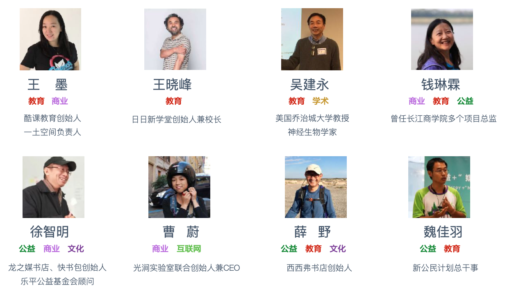]]
---
class: middle, center
# 荣誉
.center[.width-110[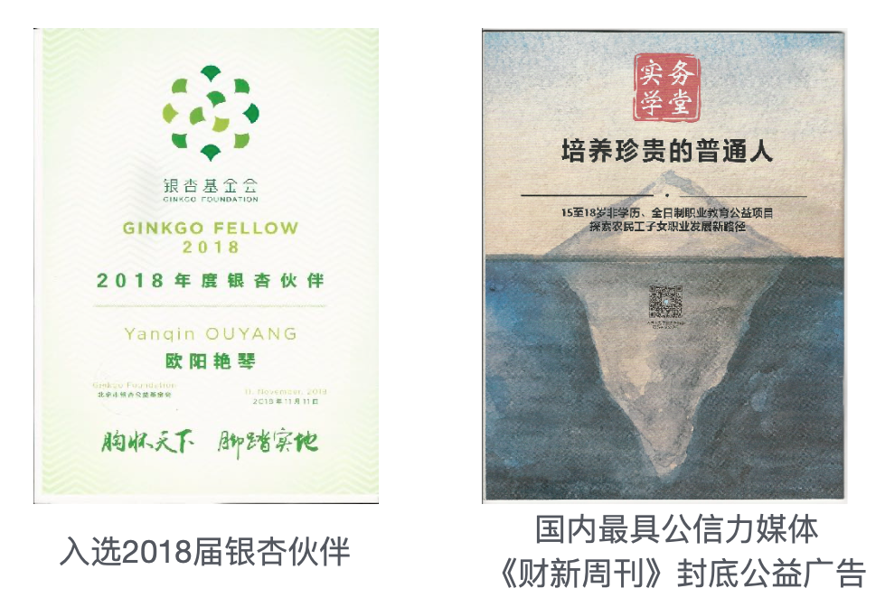]]
---
# 学生的话

- “学堂对我来说就像第⼆个家”
- “学堂可能意味着希望吧"
- "我希望我能够在其中提⾼自⼰的能⼒、找到未来的⽅向”
---
# 参考链接
- 欧阳艳琴，《一个「珍贵的普通人」要如何成长》，声东击西，2020年4月21日，链接：
https://mp.weixin.qq.com/s/7gAGBFEgaPHXFa20qMrPkg
- 欧阳艳琴，《如果教育不能改变阶层，还要做教育吗？》，奴隶社会，2019年7月11日，链接：
https://www.sohu.com/a/326087230_484992
---
# 培养方案
- 全人教育
  - ⽣理、⼼理、体育、生活、⼈文、科学
- 职业素养
  - 职业体验、沟通实践、项⽬实践
- 专业技能
  - 编程，玻璃艺术，平面设计，写作与运营
---
class: middle, center
# 全人教育

以人格为本

.center[.width-70[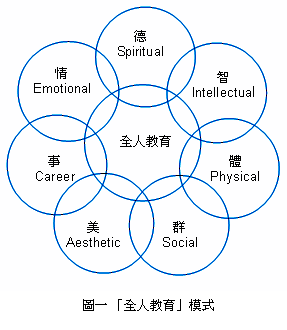]]
---
# [全人教育](http://www.jyb.cn/theory/lltw/201508/t20150820_634376.html)
- 古希腊教育思想已蕴含，联合国教科文组织推广
  - 强调儿童身心全面、完整、均衡发展，反对片面、狭隘、畸形发展
  - 立人，注重理智、情感、美感、创造力和精神潜能
- 杨东平老师
  - 重视人文精神的养成，通过人文教育达到全人发展目标
  - 不仅意味着人的全面素质，同时蕴涵着一种广博的世界观，关心环境、关心和平、关心全人类，培养出理性的、人文的、道德的、精神的各方面和谐发展的全人
- 夏青峰老师
  - “促进人的全面而自由的发展”
---
class: middle, center
# 全人视角下的计算机科学教育

以《[哈佛大学计算机科学学生手册](https://handbook.fas.harvard.edu/book/computer-science)》为例
---
# 理解

- 计算机科学是动态，多用途的领域，充满开放问题和创新发明机会。
- 计算机科学不仅涉及工具和技术。无论是昆虫，基本粒子，市场理性因素，还是大脑神经元，计算视⻆都是理解自然，社会和工程系统极有效的方式。
- 计算机科学专业不仅与工程学密切相关，而且与经济学，法学，生物学，物理学，统计学，数学等也有紧密联系。

---
# 教育目的

- 向学生传授
  - 能立即使用的技能
  - 在将来，会以目前无法想象的方式，得以利用的思想。
- 职业选择
  - 信息技术影响社会方方面面，拥有计算机科学学位的毕业生可选择各种职业
  - 工程，教学，医学，法律，基础科学，娱乐，管理等

---
# 目标

- 硬目标
  - 设计和编码正确的问题解决方案
  - 向社会外界解释系统设计方案的适用性
  - 听完一个 CS 讲座后，客观地分析和批判工作
- 软目标
  - 以口头和书面形式，清晰，有力地表达想法
  - 以合乎道德的原则，合作解决问题
  - 将自己的优势运用到实际中，解决社会不公、脆弱、和让人不舒服的地方
  - 在小组内高效，负责任和有效地工作
---
class: middle, center
# 实务学堂的编程

15-18岁农民工子女职业教育公益项目

为资源贫乏的高中生提供技能、经验和联系

使他们能够共同进入技术职业
---
# 学生情况
- 人数：15
- 年龄：14-20（15-18为主）
- 初中肄业或中职肄业
---
# 开设课程
- 计算机原理
- 软件开发概念
- Java编程
- 数据结构与算法
- Web应用开发
- 企业访问
- 实习
---
class: middle, center
# 访问谷歌
.center[.width-60[]]
---
class: middle, center
# 访问思科
.center[.width-100[]]
---
class: middle, center

##学生的话

# 学习了Web后

我可以看懂别人的代码什么意思

我可以做出自己想做的网页

我可以找到工作
---
# 过去两年的探索
- Khan前端编程
- 中国大学慕课网林大Web前端课程
- 职校课程
- FCC
- CodeNation
---
# 探索1: [Khan前端编程](https://www.khanacademy.org/computing/)
- JS入门：绘画和动画
- HTML /CSS简介：制作网页
- SQL简介：查询和管理数据
- 高级JS：游戏与可视化，自然模拟
- HTML /JS：使网页具有交互性，jQuery交互
- 认识专业人士
---
# 练习系统

- 内容有趣，自动反馈，导学系统

.center[.width-110[]]
.center[[作品链接](https://www.khanacademy.org/computer-programming/pjs/6016151168122880)]
<!-- https://www.khanacademy.org/computer- programming/spin-off-of-project-ad-design/4869417505292288 -->
<!-- https://www.khanacademy.org/computer-programming/house/6219603961872384 -->
---
# 后台

- 课程管理，学生状态，学生晋级，证书

.center[.width-100[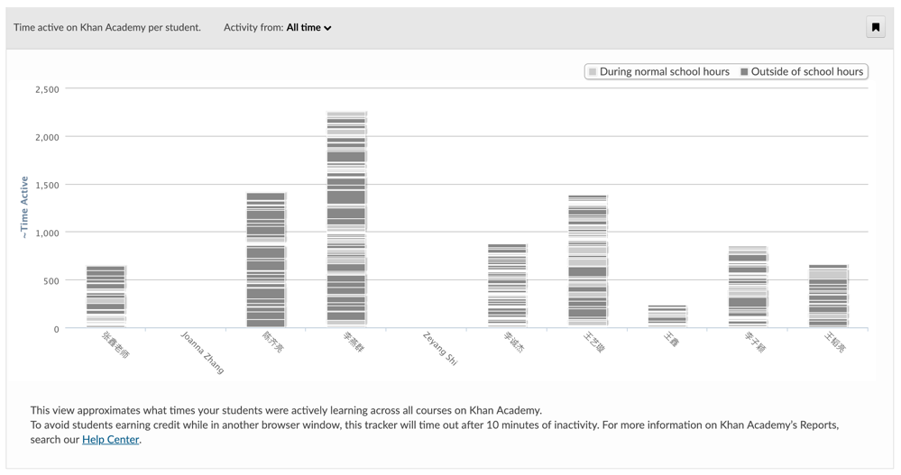]]
.center[学生学习时间统计]
---
class: middle, center
# 学生状态
.center[.width-40[] .width-40[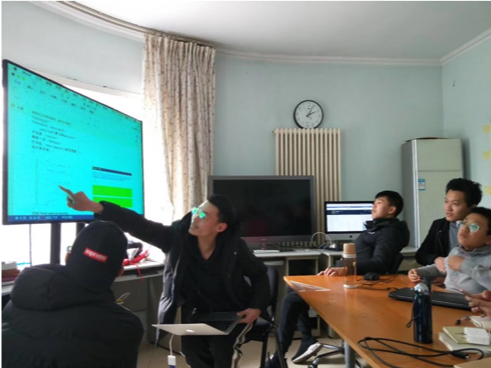]]
.center[李燕群同学]
---
# Khan小结
- 优点
  - 边讲边练，做中学
  - 极为专业
- 不足
  - 英文
  - 入门内容，激发兴趣为主，不面向职业
---
# 探索2: 林大[Web前端编程](https://www.icourse163.org/learn/BJFU-1003382003)慕课
- HTML+ CSS + JS + 案例
- 优点
  - 讲解细致，知识点全面
- 不足
  - 传统课堂方式，以讲为主，学生坐不住
  - 入门内容，不面向职业
---
# 探索3：职校课程
- 优点
  - 讲解生动、内容全面，面向职业
- 问题
  - 内容太多，进度太快，适合全职
  - 我们的学生不仅学编程，还有其他核心课程（人文、社会、艺术、职业素养）
---
# 探索总结
- 什么样的系统适合这些孩子？
  - 做中学
  - 容易上手
  - 最后又达到职业的水平
- FCC
---
# FCC的优点
- 中文
- 以职业为目标，这一点和我们特别匹配
- 社群
- 志愿者（好榜样，氛围）
- 做中学（练习是最重要的）

.center[罗明杨同学给下一届同学的嘱托]

.center[.red[“FCC作业特别好，做FCC特别重要]“]
---
class: middle, center
# [王鑫同学作品](https://xinbaobao3775.github.io/xinbaobao3775/)

.center[.width-110[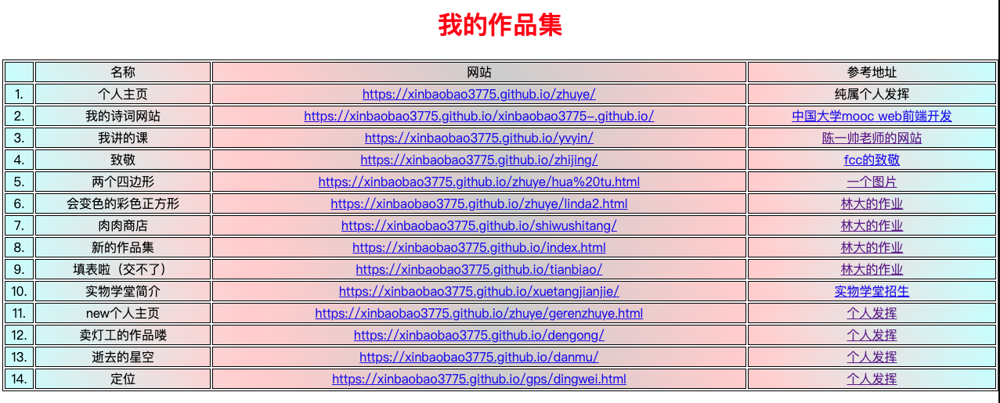]]
---
# 目前课程
- 软件工程
- Java编程
- 算法与数据结构
- 编程英语
- Web应用开发
---
# 软件工程
- 南京大学《[程序猿与攻城狮](https://www.icourse163.org/course/NJU-1001616012)》慕课

.center[.width-90[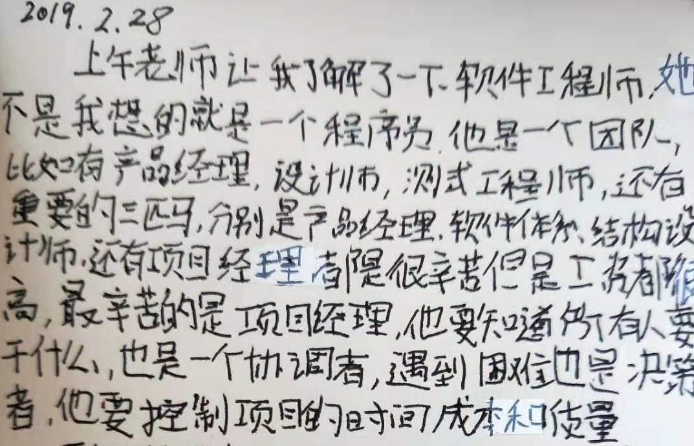]]
---
# Java编程
  * 魏林老师基于斯坦福CS106编译
  * 生动风趣，内容科学（[全套视频B站链接](https://space.bilibili.com/393215832/)）

.center[.width-100[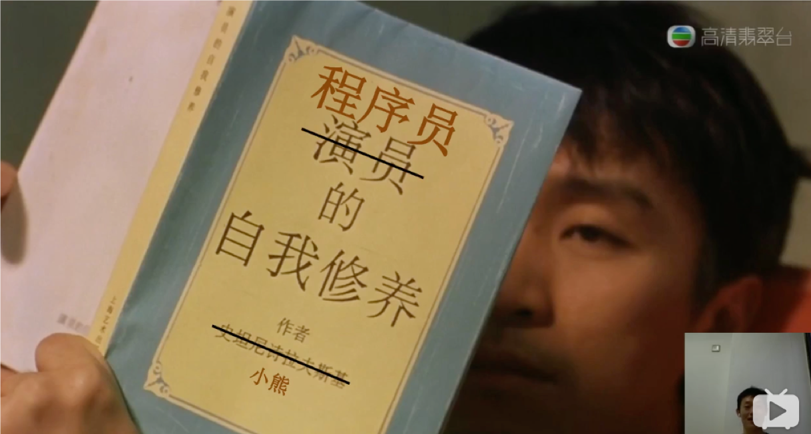]]
<!-- * https://vijos.org/d/kidolab_2019_Spring/ -->
---
# 算法与数据结构
* 李志老师
* 高中信息学竞赛大纲
* 内容完整、系统，知识结构合理，直至算法

.center[.width-30[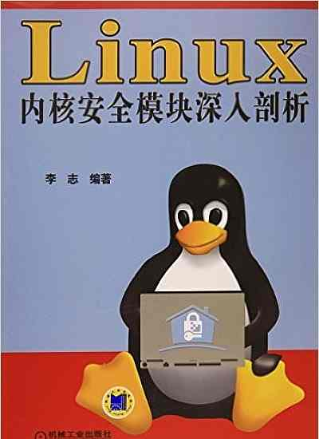]]
.center[李志老师作品]
---
# 编程英语
* Elsie （纽约顶级媒体撰稿人）
* 美剧《硅谷》，电影《图灵》
* 场景对话模拟
* Vue视频配音
---
# Web应用开发
- 引进纽约编程教育公益组织 [CodeNation](https://codenation.org/) 系列课程
- 目标和我们特别一致
  - “为资源贫乏的高中学生提供技能，经验和联系，使他们能够共同进入技术职业”
- 已探索多年，主要在纽约和加州活动（志愿者多）
  - 课程设计经过多次迭代
- 目前已经有上千学生
---
# CodeNation [三级培养方案](https://github.com/itscodenation/curriculum19-20)
- 接触（Exposure）
  - 课后班
  - 介绍HTML，CSS和JavaScript，JQuery简单网页
- 体验（Experience）
  - 暑假集训
  - 更高级JavaScript概念（包括API）项目，专业技能（白板编程，电子邮件）
- 职业（ Agency ）
  - 现场实习
  - 更高级API，Firebase，前端框架（ReactJS），专业发展（简历，作品集）
---
# 课程特点
- 内容精当，每次课1小时容量
  - 一个知识点
  - 精心安排，符合教学规律
  - 讲解、编程示范、小测验
- 内容吸引人
  - 漫威、篮球、小游戏
- 特别是：作业吸引人！
  - 同学的话：“好期待做作业啊”
  - “老师今天只有一个作业么？”
---
# 与FCC的集成
- CodeNation适合新手
  - 归纳和完善过程
  - 提兴趣，做小项目
  - 每一节课，指定少量对应的FCC练习
- FCC
  - 进入职业班后，转入FCC
  - 补足职业内容
  - 记忆和流利的过程
---
# 学期反馈

- 内容很清楚，互动也挺好，作业每节课都有，不会很难，都能做，很开心
- 课程很有意思，易懂
- 上课气氛活跃，知识点讲的透彻，老师上课幽默，气氛好
- 讲的很细
---
class: middle, center
# 王台归同学作品

.center[.width-70[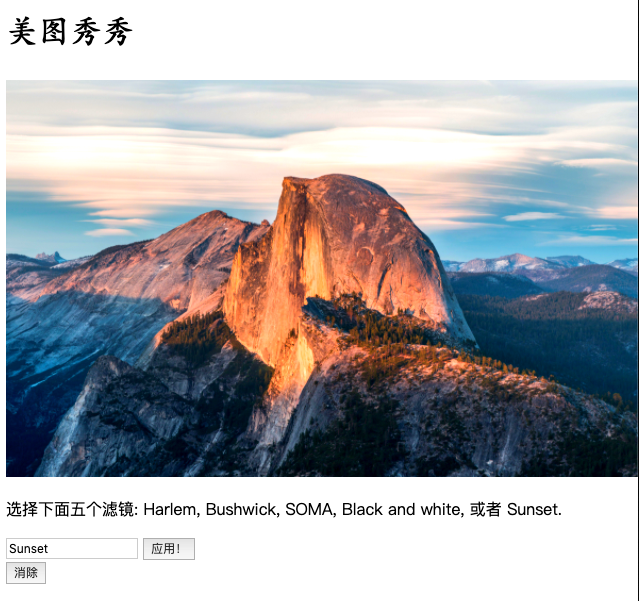]]
.center[[点击体验](https://wtg378900.github.io/-4/)]
---
class: middle, center
# 艾克同学作品

.center[.width-100[]]
.center[[点击体验](https://mcqueen5258.github.io/5-js-packing-list/)]
---
class: middle, center
# 崔永祥同学作品

.center[.width-30[]]

.center[[点击体验](https://hcnjyfv.github.io/ex24/)]
---
class: middle, center
# 罗家祥同学作品

.center[.width-50[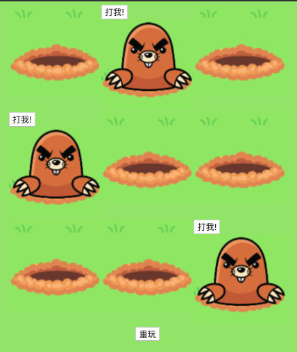]]
.center[[点击体验](https://mcqueen5258.github.io/whackLuo/)]
---
class: middle, center
# 葛雨城同学作品

.center[.width-90[]]
.center[[点击体验](https://popcode.org/?snapshot=b7d3f215-19fc-4130-af7f-d3f0b6c08dad)]
---
class: middle, center
# 王鑫同学作品

.center[.width-80[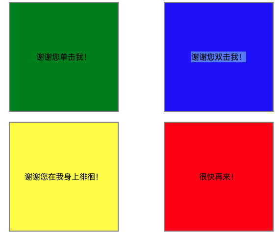]]
.center[[点击体验](https://xinbaobao3775.github.io/zuopin/CH13/index.html)]
---
class: middle, center
# 周光明同学作品

.center[.width-110[]]
.center[[点击体验](https://guangmingniunai.github.io/huanlewu.)]
---
class: middle, center
# 罗明杨同学作品

.center[.width-110[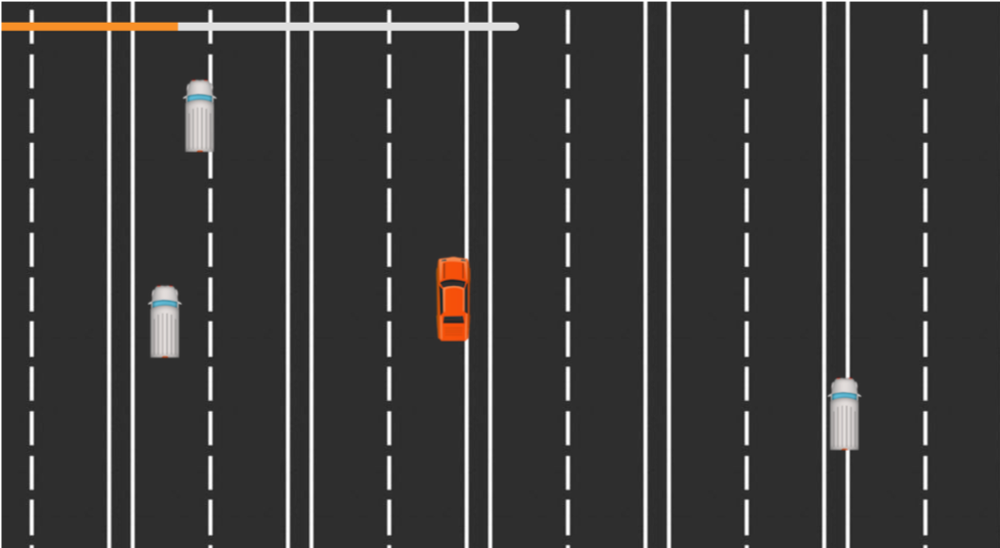]]
.center[[点击体验](https://lizilita.github.io/project/CarGame/CarGame.html)]

---
class: middle, center
# 雷涵同学作品

.center[.width-90[]]
.center[[点击体验](https://leizhonghan.github.io/operation/)]
---
# 课程材料

- [前端开发教程](../js/index.html)，实务学堂，2020年
- 视频，作业起始代码，示例代码（作业最关键）

.center[.width-90[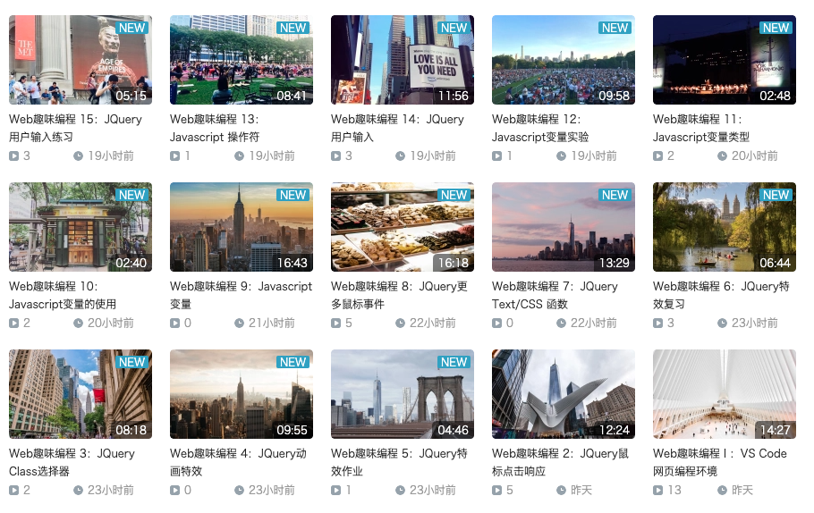]]
