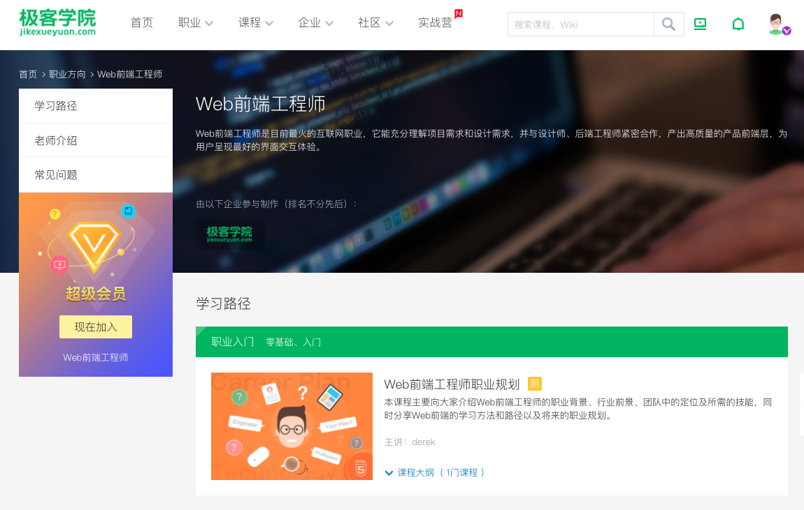
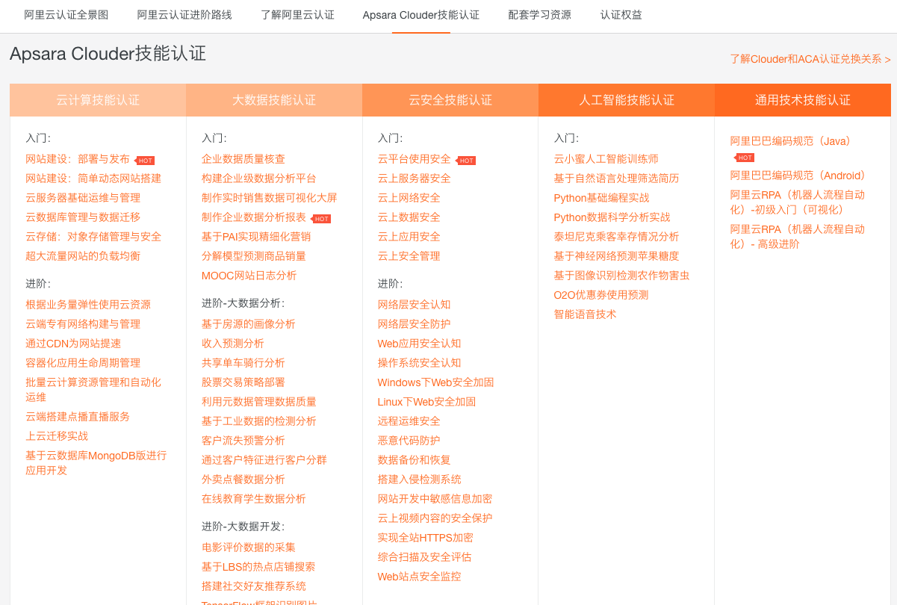

class: middle, center

# 目前进展

陈一帅
---
# 内容
- .red[课程体系]
- 同学作品
---
# 课程体系
- 软件工程
- 编程体验营
- Java编程
- 算法与数据结构
- 编程英语
- Web应用开发
---
# 软件工程
- 南京大学《[程序猿与攻城狮](https://www.icourse163.org/course/NJU-1001616012)》慕课

.center[.width-90[]]
---
# 编程体验营
- [谷歌Blockly编程](https://blockly-games.appspot.com/?lang=zh-hans)
- 为程序员设计的可视化编程，对应Javascript代码
- 直达算法、逻辑、循环、函数、变量等概念

.center[.width-70[]]
.center[B站 [视频](https://h.bilibili.com/38320283)，[照片](https://www.bilibili.com/video/BV1oJ411F7aj) 链接]
---
# Java编程
  * 魏林老师基于斯坦福CS106编译
  * 生动风趣，内容科学（[全套视频B站链接](https://space.bilibili.com/393215832/)）

.center[.width-100[]]
<!-- * https://vijos.org/d/kidolab_2019_Spring/ -->
---
# 算法与数据结构
* 李志老师
* 高中信息学竞赛大纲
* 内容完整、系统，知识结构合理，直至算法

.center[.width-30[]]
.center[李志老师作品]
---
# 编程英语
* Elsie （纽约顶级媒体撰稿人）
* 美剧《硅谷》，电影《图灵》
* 场景对话模拟
* Vue视频配音
---
# Web应用开发
- 引进纽约编程教育公益组织 [CodeNation](https://codenation.org/) 系列课程
- 目标和我们特别一致
  - “为资源贫乏的高中学生提供技能，经验和联系，使他们能够共同进入技术职业”
- 已探索多年，主要在纽约和加州活动（志愿者多）
  - 课程设计经过多次迭代
- 目前已经有上千学生
---
# CodeNation [三级培养方案](https://github.com/itscodenation/curriculum19-20)
- 接触（Exposure）
  - 课后班
  - 介绍HTML，CSS和JavaScript，JQuery简单网页
- 体验（Experience）
  - 暑假集训
  - 更高级JavaScript概念（包括API）项目，专业技能（白板编程，电子邮件）
- 职业（ Agency ）
  - 现场实习
  - 更高级API，Firebase，前端框架（ReactJS），专业发展（简历，作品集）
---
# 课程特点
- 内容精当，每次课1小时容量
  - 一个知识点
  - 精心安排，符合教学规律
  - 讲解、编程示范、小测验
- 内容吸引人
  - 漫威、篮球、小游戏
- 特别是：作业吸引人！
  - 同学的话：“好期待做作业啊”
  - “老师今天只有一个作业么？”
---
# 与FCC的集成
- CodeNation提兴趣，做小项目
- 但一次课知识点覆盖还是不够
- FCC补足职业内容
- 每一节课，指定对应FCC练习
- 期待FCC新版（项目制？）
---
# [极客学院](https://www.jikexueyuan.com/zhiye/web)
.center[.width-90[]]

.center[感谢极客学院的大力支持]
---
# 阿里云学院
.center[.width-90[]]

.center[感谢阿里云学院的大力支持]

---
# 内容
- 课程体系
- .red[同学作品]
---
class: middle, center
# 王台归同学作品

.center[.width-70[]]
.center[[点击体验](https://wtg378900.github.io/-4/)]
---
class: middle, center
# 艾克同学作品

.center[.width-100[]]
.center[[点击体验](https://mcqueen5258.github.io/5-js-packing-list/)]
---
class: middle, center
# 崔永祥同学作品

.center[.width-30[]]

.center[[点击体验](https://hcnjyfv.github.io/ex24/)]
---
class: middle, center
# 罗家祥同学作品

.center[.width-50[]]
.center[[点击体验](https://mcqueen5258.github.io/whackLuo/)]
---
class: middle, center
# 葛雨城同学作品

.center[.width-90[]]
.center[[点击体验](https://popcode.org/?snapshot=b7d3f215-19fc-4130-af7f-d3f0b6c08dad)]
---
class: middle, center
# 王鑫同学作品

.center[.width-80[]]
.center[[点击体验](https://xinbaobao3775.github.io/zuopin/CH13/index.html)]
---
class: middle, center
# 周光明同学作品

.center[.width-110[]]
.center[[点击体验](https://guangmingniunai.github.io/huanlewu.)]
---
class: middle, center
# 罗明杨同学作品

.center[.width-110[]]
.center[[点击体验](https://lizilita.github.io/project/CarGame/CarGame.html)]

---
class: middle, center
# 雷涵同学作品

.center[.width-90[]]
.center[[点击体验](https://leizhonghan.github.io/operation/)]