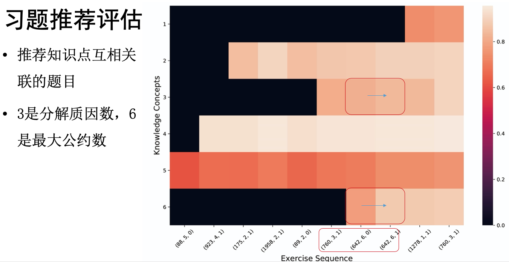
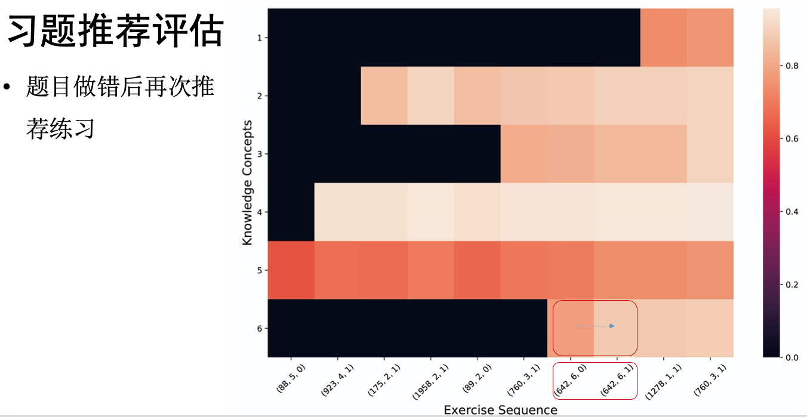

class: middle, center
# 学术研究
陈一帅
---
# 学术研究
- .red[知识表征]
- 学生模型
- 智能导学
- 学术会议
---
# 知识表征
- 习题表征
- 机器翻译
- 代码搜索
---
# 习题表征
- 冯梦菲，深度学习（自然语言处理）
- 习题文本深度表征，相似题推荐

.center[.width-80[]]
---
# 学术研究
- 知识表征
- .red[学生模型]
- 智能导学
- 学术会议
---
# 学生手册图像识别
- 潘翰祺，曹中
- 学生等第、评价、手写体数字识别

.center[.width-80[]]
---
# 图像识别
- 表格拆分，目标检测
- 数据增强，图像识别

.center[.width-40[] .width-40[]]
---
# 学生练习过程可视化
- 斯坦福大学Chris Piech团队
- code.org 50万学生 [练习路径可视化](http://stanford.edu/~cpiech/demos/research/blossoms.html)

- 学生尝试中，从一种局部解决方案转向另一种局部解决方案的动态过程
- 学生模型：预测学习成果，风险
---
# 学术研究
- 知识表征
- 学生模型
- .red[智能导学]
- 学术会议
---
# 智能导学
- 艾方哲
- 假设有无穷多、可无穷次尝试的学生
- 如何学习最佳导学策略
- 类似AlphaGo

.center[.width-90[]]
---
# 智能导学
- 深度知识追踪
- 基于深度强化学习的导学策略优化
- [论文及代码（Github）](https://bjtu-netcomm.github.io/nilab/2019/Aifangzhe/aifangzhe.html)

.center[.width-70[]]
---
# 仿真结果
.center[.width-110[]]

.center[推荐相关知识点习题]
---
# 仿真结果
.center[.width-110[]]

.center[错题重做]
---
# 学术研究
- 知识表征
- 学生模型
- 智能导学
- .red[学术会议]
---
# 学术会议
- ACM Special Interest Group on Computer Science Education ([SIGCSE](http://sigcse2020.sigcse.org/))
- ACM Innovation and Technology in Computer Science Education ([ITiCSE](http://iticse.acm.org/))
- ACM Special Interest Group for Building Educational Applications (SIGEDU)
  - Workshop on Innovative Use of NLP for Building Educational Applications ([BEA](https://sig-edu.org/bea/current))
- Artificial Intelligence in Education([AIED](https://aied2020.nees.com.br/))
- Educational Data Mining ([EDM](http://educationaldatamining.org/edm2020/))